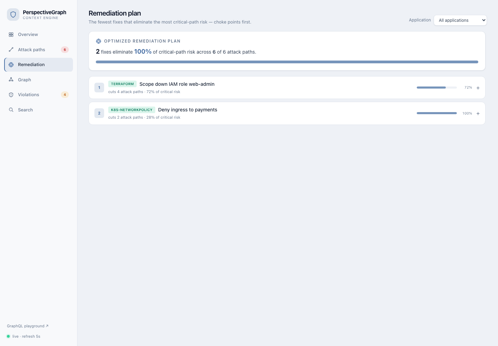

#  PerspectiveGraph

[](https://github.com/luiacuaniello/perspectivegraph/actions/workflows/ci.yml)
[](https://github.com/luiacuaniello/perspectivegraph/releases)
[](backend/go.mod)
[](LICENSE)

> **Catch the attack path in the pull request that opens it - then ship the fix as a PR.**

On every pull request, PerspectiveGraph (open source, Apache 2.0) answers one question against a
graph of your *real* environment - built from the scanners you already run (Trivy, Semgrep, Cloud
Custodian, Falco):

> *Does this change open a path from the internet, through excessive privilege, to something valuable?*

When it does, the **PR check goes red** - a required status you can block the merge on - and you get
the **fix as its own one-click pull request**. The reachable attack path is caught and closed in code
review, where it's cheapest, not months later in production. This is **shift-left attack-path
analysis**: not a scanner bolted onto CI, not a runtime CNAPP you log into after the fact - the
reachability question, answered *in the developer's workflow*.

That gate is powered by a full attack-path correlation engine, so the same graph also gives you the
rest: a queryable dashboard of your **~5 critical attack paths** (not 10,000 flat findings), triage,
runtime confirmation, an AI summary, and always-current architecture maps. **But the wedge is the
pull request.**


<details>
<summary>More: ranked attack paths with kill chain, and the choke-point remediation optimizer</summary>




</details>

## Project status & maturity

PerspectiveGraph is **pre-1.0** and built in the open. Read this before you rely on it:

- **Engine: feature-complete.** The correlation engine, agentless connectors, triage,
  SSO, the PR merge-gate, the AI assistant, and the scale work are all implemented and
  covered by tests. The public API contract (GraphQL, ingest events, config, CLI) is
  documented and the GraphQL schema is frozen + drift-guarded - see the
  [API stability policy](docs/API-STABILITY.md).
- **Probabilities: calibrated on synthetic topology, not yet field-validated.** The
  self-calibration flywheel has been exercised end-to-end against deliberately-vulnerable
  targets (a log4shell app, a `kind` Kubernetes RBAC scenario) - not yet against a breadth
  of real cloud/Kubernetes accounts. Treat the path scores as **directionally honest, not
  production-validated**. The `make validate-aws` and `make validate-harness*` harnesses
  are the path to changing that, on your own environment.
- **Deployment: demo-grade defaults.** The bundled `docker compose` / Helm setup is
  hardened for a demo (distroless, non-root, read-only rootfs, digest-pinned 0-CVE images,
  opt-in TLS). A production rollout still needs your own hardening: an external managed
  PostgreSQL+AGE, secrets in a manager (not env vars), TLS on by default, backups, and HA
  for the leader-gated scheduler. See the [operations & hardening runbook](docs/OPERATIONS.md),
  [`SECURITY.md`](SECURITY.md), and the [threat model](docs/THREAT-MODEL.md).
- **Scope.** It answers the reachable attack-path question in the developer workflow. It is
  not a scanner, a CNAPP, or a compliance product, and it does not replace them.

Issues and PRs are welcome. Nothing here is claimed beyond what the tests and the listed
validation cover.

## Why?

Modern security teams don't suffer from a lack of tools - they suffer from **noise, fragmentation,
and missing context**.

| Role | Pain today | What PerspectiveGraph gives them |
| --- | --- | --- |
| **Developer** | CI/CD blocked by thousands of irrelevant CVEs | A PR check that goes red *only* when the change opens a real internet→sensitive-asset path - plus the fix as a one-click PR |
| **Security** | Triage on flat lists of 10,000 findings | A ranked list of ~5 critical **attack paths**, queryable like a database |
| **Architect** | No live view of how IaC becomes attack surface | Auto-generated, always-current architecture & data-flow maps + drift detection |

## The core idea

We model the whole environment as a directed graph `G = (V, E)`:

- **Vertices `V`** - assets, identities, and findings (`Container`, `IAM_Role`, `CVE`, ...)
- **Edges `E`** - relationships (`HOSTS`, `ASSUMES`, `AFFECTS`, `EXPOSES`, ...)

An **attack path** `P` is a sequence of nodes `v₁ → v₂ → … → vₖ` from an *Internet-Exposed* node to a
*Sensitive Asset*. The **baseline** score composes the per-edge exploit probabilities:

```
S(P) = ∏  p(vᵢ, vᵢ₊₁)
      i=1..k-1
```

Taking `-ln` turns this into an additive cost `w = -ln p`, so the **highest-probability path is the
shortest path** - found with Dijkstra from every internet-exposed seed, then surfaced as
**Critical Attack Path** events.

That product is only the *starting point*: it assumes the hops are independent and treats a heuristic
guess like measured evidence. The engine is honest about all three gaps, and the layers are what make
it a risk tool rather than a number generator (see [Honest probabilities](#honest-probabilities-provenance-not-false-precision)):

- **Correlation** - the product assumes independent hops, so it also reports `scoreUpperBound` (the
  shared-cause bound) and flags `correlatedHops`; the real value lies in `[score, scoreUpperBound]`.
- **One coherent posterior** (`posteriorMean` + `[scoreCiLow, scoreCiHigh]`) - a single Monte Carlo
  composes the two uncertainties that used to be separate, non-nesting numbers: **epistemic** (each `p`
  is a **Beta posterior** whose width reflects its evidence - KEV/runtime tight, heuristic wide; a real
  `evidence_count` sets it directly when known) and **attacker capability** (the score is marginalized
  over a latent attacker, `S(P) = Σ_c P(c)·∏ p(e|c)` over commodity/criminal/APT, reintroducing the
  correlation the bare product drops). `posteriorMean` is the coherent point estimate the credible
  interval brackets (it even corrects the Jensen gap the plug-in `mixtureScore` ignores); `profileScores`
  keep the per-profile breakdown. The **headline risk** (`riskSimulation`) is marginalized the same way
  (`Σ_c P(c)·R_c`, `mixtureCompromiseProbability` + `profileCompromise`), so the environment number and
  the per-path scores share one correlation model instead of the Monte Carlo silently assuming
  independent edges.
- **Calibration** - red-team/BAS verdicts grade the scores against reality (Brier/ECE + a diagnosis),
  so "55%" is a *defensible probability*, not a label - the line between a demo and production.

## Architecture

PerspectiveGraph is **event-driven and modular**. Each layer is decoupled so individual scanners and
sensors can be swapped without touching the core. Data flows in one direction: raw scanner output →
normalized events → graph → attack paths → actions.

```
┌─────────────────────────────────────────────────────────────────────────────┐
│ 1. INGESTION LAYER  (Go plugins)                                              │
│    Static collectors (Trivy, Semgrep, Checkov)  - push via webhook / file     │
│    Agentless connectors (AWS, Azure, …)         - scheduled PULL, leader-only │
│    Discovery collectors (K8s, cloud-net, IAM)   - topology & privesc graph    │
│    Runtime collectors (Falco / eBPF)            - live syscall stream         │
│    → push and pull both normalize to an event and publish it on the same bus  │
└───────────────────────────────────┬───────────────────────────────────────────┘
                                     │  NATS JetStream  (subject: perspective.events.*)
                                     ▼
┌─────────────────────────────────────────────────────────────────────────────┐
│ 2. NORMALIZATION & IDENTITY RESOLUTION                                        │
│    Maps every tool's vocabulary onto one common Ontology.                      │
│    Deduplicates assets (Trivy "image:tag" == ECR ARN == K8s PodSpec).         │
└───────────────────────────────────┬───────────────────────────────────────────┘
                                     ▼
┌─────────────────────────────────────────────────────────────────────────────┐
│ 3. GRAPH CORE   (PostgreSQL + Apache AGE, openCypher)                          │
│    Stores the directed graph G = (V, E). Upserts nodes & edges.               │
└───────────────────────────────────┬───────────────────────────────────────────┘
                                     ▼
┌─────────────────────────────────────────────────────────────────────────────┐
│ 4. ATTACK PATH ANALYZER                                                       │
│    Traverses from `internet-exposed` seeds to `sensitive-asset` targets.      │
│    Scores paths: S(P) = ∏ p(edge). Emits Critical Attack Path events.         │
└───────────────────────────────────┬───────────────────────────────────────────┘
                                     ▼
┌─────────────────────────────────────────────────────────────────────────────┐
│ 5. ACTION & FEEDBACK + API (BFF)                                              │
│    GraphQL API for the dashboard. PR comments for devs. Policy invariants     │
│    for architects. Auto-remediation suggestions (Terraform / K8s NetworkPol). │
└─────────────────────────────────────────────────────────────────────────────┘
```

## The ontology

The common vocabulary every collector maps onto. Defined in
[`backend/pkg/ontology`](./backend/pkg/ontology).

| Category | Node labels (`V`) | Edge types (`E`) |
| --- | --- | --- |
| **Infrastructure** | `VirtualMachine`, `Container`, `VPC`, `LoadBalancer`, `Database`, `Bucket` | `HOSTS`, `CONNECTS_TO`, `EXPOSES`, `ROUTES_TO` |
| **Code / App** | `Repository`, `Package`, `Library`, `Image` | `DEPENDS_ON`, `COMPILED_INTO`, `BUILT_FROM` |
| **Identity** | `User`, `IAM_Role`, `ServiceAccount` | `ASSUMES`, `HAS_PERMISSION`, `CAN_ESCALATE_TO` |
| **Security** | `CVE`, `Weakness`, `Misconfiguration`, `Secret` | `AFFECTS`, `EXPLOITS`, `MITIGATES` |

`CVE` is a known vulnerability in a dependency (from Trivy); `Weakness` is a
SAST/code-level finding, CWE-classified (from Semgrep); `Misconfiguration` is an
IaC/cloud misconfiguration; `Secret` is an exposed credential.

`CAN_ESCALATE_TO` is an IAM **privilege-escalation** edge: a principal that can,
through its effective permissions, gain another's privileges (the "BloodHound
for cloud" question). The IAM collector flattens each principal's allowed
actions and matches them against known escalation primitives (e.g. `iam:PassRole`
+ a compute action, `iam:AttachUserPolicy`, `iam:CreatePolicyVersion`), drawing
the edge toward a synthetic account-admin sensitive asset. A role whose trust policy
admits `"Principal":"*"` is marked `internet_exposed` - publicly assumable, the
seed of a full internet→admin path.

Two boolean node attributes drive analysis:

- `internet_exposed` - a valid **seed** for traversal.
- `crown_jewel` - a valid **target** (e.g. a DB holding PII, an admin IAM role).

## Risk scoring

Each edge carries an exploit probability `p ∈ (0, 1]`. The probability that a full path is
exploitable (assuming independence, for tractability) is the product of its edge probabilities:

```
S(P) = ∏ p(vᵢ, vᵢ₊₁)
```

We convert to a traversal cost `w = -ln(p)` so that **maximizing `S(P)` becomes a shortest-path
problem** (minimizing `Σ w`) solvable with Dijkstra. See
[`backend/internal/analyzer`](./backend/internal/analyzer).

The product assumes the hops are **independent**. When they share a common cause (one weakness
gating several steps) they are positively correlated, and the product is then a *lower* bound for
"all hops succeed"; the comonotonic (Fréchet) upper bound is the weakest single hop, `min p`. So
rather than dressing up `S(P)` as exact, each path also exposes a `scoreUpperBound` (= `min p`) and
a `correlatedHops` flag (set when ≥2 hops rest on the same weight basis) - the true exploitability
lies in `[score, scoreUpperBound]`, and a wide band says the independence assumption is doing the
work. The headline score is unchanged.

A second, orthogonal uncertainty is *epistemic*: how well is each `p` known at all? Each edge is
modelled as a **Beta(α,β) posterior** with mean `p` and concentration κ scaled by the weight basis's
confidence - many pseudo-observations for kev/runtime, few for a heuristic guess
([`uncertainty.go`](./backend/internal/analyzer/uncertainty.go), Marsaglia-Tsang gamma→beta, zero
deps). Propagating those posteriors through the product gives a 90% credible interval per path
(`scoreCiLow`/`scoreCiHigh`), and re-driving the Monte Carlo from them (an outer epistemic loop
around the inner reachability trials) replaces the old flat ±30% sensitivity band with one the
evidence justifies. Point estimates are untouched; only their *trust* is now quantified.

The independence assumption itself is addressed at the root by an **attacker-profile mixture**
([`profiles.go`](./backend/internal/analyzer/profiles.go)). Hops are correlated through a latent
variable - the attacker's capability - so the score is marginalized over a small set of profiles c
(commodity/criminal/apt), each with a prior `P(c)` and a skill that shifts every hop's success
log-odds, scaled by the hop's skill-sensitivity (≈0 for a public KEV exploit, ≈1 for a heuristic
guess): `p(e|c) = σ(logit p + skill(c)·sens(basis))`, `S(P) = Σ P(c)·∏ p(e|c)`. Conditioning makes
independence honest *within* a profile; marginalizing reintroduces the correlation the bare product
drops. The per-profile breakdown (`profileScores`, `mixtureScore`) is the *"72% vs an APT, 18% vs
commodity"* read a SOC triages on. Priors are operator-tunable via `ATTACKER_PROFILE_PRIORS`; the
naive `Score` stays as the independent baseline.

**Where the traversal runs.** Node *and edge* properties are stored as **native
agtype** in Apache AGE, so the graph is genuinely queryable. The per-pass
critical-path search uses the **in-process Dijkstra by default** - a polynomial,
bounded algorithm that is the right engine for "all best paths every pass".

A DB-side finder is available as an **opt-in** (`ANALYZER_DB_PATHS=true`): a Cypher
variable-length match (`MATCH p=(a)-[*1..N]->(b) WHERE a.internet_exposed AND
b.crown_jewel`, bounded by `ANALYZER_MAX_HOPS`). It is honestly *not* a perf win
for the batch - AGE has no weighted shortest-path, so this **enumerates** paths,
which is unbounded in the worst case on dense/cyclic graphs. It is therefore
safe-railed (server `statement_timeout` + `LIMIT`, plus a client deadline that
**falls back to Dijkstra** on a runaway query) and best reserved for bounded or
targeted queries. The store-contract test asserts the DB finder and Dijkstra
agree on scores, and documents the recall bound when a path exceeds `maxHops`.
Either way the per-pass snapshot is materialized for the policy-invariant engine
and the Monte Carlo risk model, which need the full edge set.

### Scaling the analyzer

Three layers keep the per-pass cost flat as the graph grows, in increasing order
of how much they assume:

- **Change-detection (always on).** The analyzer skips a pass entirely when the
  store's write version hasn't moved since the last one - a steady graph costs
  nothing but a version read (a periodic forced rescan bounds staleness for the
  multi-replica case, where another replica's writes don't move *this* process's
  counter).
- **Parallel pathfinding (on by default).** Each internet-exposed seed runs an
  independent Dijkstra over the same immutable adjacency, so the searches fan out
  across a bounded worker pool (`ANALYZER_WORKERS`, default = `GOMAXPROCS`). The
  per-seed results are assembled in seed order before the final sort, so the
  output is **byte-for-byte identical to a sequential run** regardless of worker
  count - parallelism is a speedup, never a behavior change (asserted by
  `TestParallelMatchesSequential`). On a 10k-node / 64-seed synthetic graph the
  `BenchmarkPathfindWorkers` benchmark shows ~2.9× at 8 workers.
- **Incremental snapshotting (opt-in, `ANALYZER_INCREMENTAL`).** Instead of
  re-reading the whole graph each pass, the analyzer keeps it resident and patches
  it with just the elements observed since the last pass - a store `DeltaStore`
  capability (`SnapshotSince`, filtered on the same `last_seen` the pruner uses, so
  only the changed slice leaves Postgres). It still recomputes *all* paths (an
  attack path can change non-locally), but skips the dominant fetch +
  deserialization cost on a large AGE graph. Correctness is fenced: a full re-read
  rebuilds the cache on the first pass, right after a prune (deltas carry no
  deletions), periodically as a drift safety net, and on any delta error - and
  `TestIncrementalMatchesFullSnapshot` asserts the delta path reports the same
  paths as a one-shot full read. Graph size, snapshot mode (`full|delta`), and
  pathfinding latency are all exported to `/metrics`.

For load-testing the whole pipeline end-to-end, `perspectivegraph genload` (and
`make seed-load`) POSTs a large synthetic attack surface to the ingest webhook.

### Beyond the single best path

The per-path product answers "how exploitable is *this* route". Three analyses go further:

- **K-shortest paths (Yen's algorithm).** The top-K highest-probability loopless routes to a
  sensitive asset, so cutting the single best edge doesn't hide the near-best alternates.
- **Monte Carlo risk quantification.** Each trial realizes every edge independently (present
  with probability `p`), then checks sensitive-asset reachability. The fraction of trials where a
  sensitive asset is reachable is an unbiased estimate of its **compromise probability** - accounting for
  path multiplicity and shared edges that `∏p` can't - reported with a 95% Wilson confidence
  interval (sampling error) **and** a Beta-resampled credible band (input uncertainty; see above).
  This is the `P(at least one sensitive asset compromised)` a CISO actually asks for. It is *also*
  marginalized over the attacker-profile mixture (`mixtureCompromiseProbability = Σ_c P(c)·R_c`, with
  `R_c` conditioning every edge on `p(e|c)`), so the headline shares the per-path score's correlation
  model rather than assuming independent edges - the independent number stays as the baseline, plus a
  per-profile `profileCompromise` breakdown.
- **What-if simulation.** Remove a set of edges (a proposed remediation) and recompute paths +
  risk, using *common random numbers* so the before/after delta reflects the cut, not sampling
  noise. Pairs with the choke-point optimizer: "if we fix these N edges, residual risk drops from
  X to Y".

Exposed as the GraphQL `kShortestPaths`, `riskSimulation` and `whatIf` queries.

### Closing the loop: calibration against observed outcomes

The product, the bounds and the Monte Carlo are all *models*. What turns a model into a
production risk tool is checking it against reality. Each red-team/BAS verdict is recorded with the
path's **predicted score `S(P)` at test time** (captured server-side from the live analysis), so the
verdict log doubles as a calibration dataset: predicted probability paired with observed outcome
(confirmed→1, refuted→0, partial→0.5). From it `internal/validation` computes the standard scoring
rules - **Brier score**, **log loss**, **ECE** (expected calibration error) - plus a **reliability
diagram** (predicted vs observed per bucket) and a verdict (well-calibrated / over- / under-confident).
It also surfaces an *advisory* rescale (`observed/predicted`) rather than silently rewriting scores:
on a thin sample that would fit noise, and on a demo's synthetic outcomes it would be circular. This
is the demo→production boundary - the evidence that lets you defend a "55%" as a probability. Exposed
as the GraphQL `calibration` query and in the `GET /validations` response.

Knowing you're miscalibrated isn't enough; the report ([`diagnostics.go`](./backend/internal/validation/diagnostics.go))
adds three lenses and folds them into one **diagnosis** so the gate is self-directing. (1) **Recalibration**:
an isotonic (pool-adjacent-violators) fit yields `brierRecalibrated` - the Brier a monotone rescale can
reach - plus the `recalibrationMap` (raw → calibrated) a consumer applies out-of-band; a residual that
stays high means the model lacks *resolution*, which no rescale fixes. (2) **Segments**: calibration split
by path structure (correlated/independent hops, long/short paths, captured on the verdict at test time);
error concentrated on correlated/long paths is structural → a correlation-aware model (**#6**). (3)
**Detection**: an operator can mark a confirmed verdict `detected`; a high catch rate on high-score paths
means the score over-predicts *undetected* compromise → a detection axis (**#7**). `diagnose()` returns
`recalibrate-first | structural (#6) | detection-axis (#7) | low-resolution` - so you build #6/#7 only when
real verdicts prove the simpler fixes won't do.

## Event contract

Collectors emit a single normalized envelope (`ontology.Event`) onto NATS. This is the *only*
contract collectors must satisfy - everything downstream consumes it:

```jsonc
{
  "source": "trivy",            // which collector
  "kind": "finding",            // asset | finding | relationship | runtime
  "observed_at": "2026-06-08T…",
  "nodes": [ /* ontology.Node[] */ ],
  "edges": [ /* ontology.Edge[] */ ]
}
```

## Component map

| Layer | Package | Responsibility |
| --- | --- | --- |
| Ingestion (push) | `internal/ingestion` | HTTP webhook + collectors: scanners (`trivy`, `semgrep`, `custodian`, `falco`, `build`), discovery (`k8s` incl. deep RBAC escalation, `cloudnet`, `iam` privesc), identity federation (`sso`: IdP→User→IAM_Role) and supply-chain (`supplychain`: cosign/SLSA trust + SBOM) |
| Connectors (pull) | `internal/connector` | Agentless, scheduled PULL sources that feed the **same** bus, so the whole downstream pipeline is reused. A leader-only `Scheduler` (mirrors `analyzer.Service`) polls each `Connector`, isolates per-source failures, and exposes health at `GET /connectors` + `connector_*` metrics. Connector `aws` reuses the `cloudnet`/`iam` collectors verbatim (transport-abstracted: `fixtures` for demo/test, `aws-sdk-go-v2` for live); `azure` maps normalized `az` network state (NSG CIDR rules + ASG sources, VMs, VNet peerings) onto the `cloudnet` shape - ASG micro-segmentation becomes SG-to-SG so the east-west path forms - then reuses that collector (transport-abstracted: `fixtures`, with `azure-sdk-for-go` the wired extension point) |
| Bus | `internal/broker` | NATS JetStream publish/subscribe |
| Normalization | `internal/normalization` | identity resolution (image dedup, container→image) with **join confidence + provenance** (`resolution_method` / `resolution_confidence` / `resolution_alias`), event → graph |
| Graph | `internal/graph` | `Store` interface + in-memory & Apache AGE implementations (native agtype node/edge properties; optional DB-side `CriticalPaths` via Cypher, safe-railed; optional `Pruner` capability - `last_seen` staleness TTL so departed assets don't become phantom paths) |
| Analyzer | `internal/analyzer` | reachability (in-process Dijkstra by default; opt-in DB-side Cypher) + path scoring + runtime confirmation; Yen K-shortest, Monte Carlo risk quantification, what-if simulation |
| Compliance | `internal/compliance` | render attack-path posture as a NIST OSCAL 1.1.2 assessment-results document |
| Observability | `internal/metrics` | Prometheus collectors (ingest/normalize/analyzer/dead-letter) exposed at `/metrics` |
| Rate limiting | `internal/ratelimit` | per-client-IP token-bucket middleware for the ingest and API servers |
| Leader election | `internal/leader` | Postgres advisory-lock singleton so only one replica fires at-most-once side-effects |
| Policy | `internal/policy` | architectural invariants (forbidden graph shapes) |
| Action | `internal/action` | GitHub/GitLab PR/MR commenters (shared base) |
| Remediation | `internal/remediation` | generate K8s NetworkPolicy / Terraform to cut an edge; each fix records the structured edge it cuts so the API can *verify* it via what-if |
| Ticketing | `internal/ticket` | owned, tracked remediation tickets per path (one open per path; file-backed `TICKETS_PATH` + optional `TICKET_WEBHOOK_URL` external dispatch) |
| Validation | `internal/validation` | red-team/BAS verdicts per path (confirmed/refuted/partial/missed) + precision/recall over the tested subset; **probability calibration** (Brier/log-loss/ECE + reliability diagram) pairing each verdict with the path's predicted score; file-backed `VALIDATIONS_PATH` |
| Search | `internal/search` | optional OpenSearch full-text index |
| Suppression | `internal/suppress` | triage/suppression store (per-tenant, keyed by attack-path id; reason + owner + optional expiry; file-backed, atomic writes) |
| History | `internal/history` | temporal store: per-path lifecycle (first/last seen, open/resolved → MTTR, reopens) + posture trend series, fed each analyzer pass; file-backed (`HISTORY_PATH`) so path age survives restarts |
| API | `internal/api` | GraphQL BFF + REST triage board (`/suppressions`) for the dashboard |

The full, dated feature history is in [CHANGELOG.md](CHANGELOG.md).

## Tech stack

100% open source, no vendor lock-in, no "freemium" walls (Apache 2.0 / MIT / CNCF only):

- **Core:** Go (concurrency, tiny static binaries, cloud-native)
- **Graph DB:** PostgreSQL + [Apache AGE](https://age.apache.org/) (openCypher)
- **Event bus:** [NATS JetStream](https://nats.io/)
- **Search:** OpenSearch *(optional - `make up-search` + `OPENSEARCH_URL=http://localhost:9200`)*
- **Threat intel:** CISA KEV + FIRST EPSS *(optional - `THREATINTEL=on`)*
- **API:** GraphQL
- **Frontend:** React + TailwindCSS + [Cytoscape.js](https://js.cytoscape.org/)
- **Sensors:** Trivy, Semgrep, Cloud Custodian, Falco, CI build-provenance (`/ingest/build`), supply-chain cosign/SLSA/SBOM (`/ingest/supplychain`)
- **Discovery:** Kubernetes (`/ingest/k8s`, incl. **container-escape** detection → ATT&CK T1611), cloud-network (`/ingest/cloudnet`), IAM privilege-escalation graph (`/ingest/iam`), and SSO/IdP federation (`/ingest/sso`)
- **Data classification:** Macie/DLP findings (`/ingest/dataclass`) mark assets as sensitive assets with an authoritative `classified:<source>:<kind>` basis
- **Agentless connectors:** scheduled, leader-only **PULL** sources that reach out to a cloud account instead of waiting for an upload (`CONNECTORS_ENABLED`, health at `GET /connectors`). Connectors: **AWS** (`aws`) and **Azure** (`azure`)
- **Multi-tenant + SSO:** per-tenant isolated graphs (proven by test), bearer/OIDC auth with per-tenant/per-app/role RBAC, and a runtime login gate (`GET /auth/config` → token or "Sign in with SSO")
- **Dev workflow:** GitHub PR comment + a **PR merge-gate status** (red when the change opens an internet→sensitive-asset path), and **remediation-as-PR** (`POST /remediation/pr` opens a branch+commit+PR with the fix)
- **AI-native (Claude *or* HuggingFace):** natural-language Q&A over the graph, a board-level executive summary, and plain-English path explanations - grounded in the live attack paths (`ANTHROPIC_API_KEY`, or a free `HF_TOKEN`)
- **ATT&CK:** each kill-chain hop mapped to a MITRE ATT&CK technique + tactic

## Demo (90 seconds)

The wedge in one run: feed the security scanners you already use, watch them
correlate into a *real, reachable* internet → sensitive-asset path, and turn the fix
into a pull request. This page is the script for trying it (and for recording a
short GIF).

### Prerequisites

- Docker (the stack runs in containers; ~4 GB free is comfortable).
- `jq` and `curl` (the demo prints the top path as JSON). `brew install jq`.
- ~2-3 minutes for the first run (it builds the images).

### One command

```bash
make demo
```

That target:

1. `up-full` - builds and starts the whole stack (Postgres+AGE, NATS, backend,
   dashboard on **:3000**).
2. Seeds the sample sources - Trivy CVEs, Semgrep SAST, Cloud Custodian, Falco
   runtime alerts, a Kubernetes dump, IAM authorization details, SSO federation,
   supply-chain provenance, data classification.
3. Waits for the analyzer to correlate them, then prints the **top attack path**:
   the kill chain (internet → … → sensitive asset), its priority (P1/P2/P3), score,
   whether it's runtime-confirmed, and the **generated fix** (NetworkPolicy /
   Terraform / IAM policy).

You'll see something like:

```
════════ TOP ATTACK PATH  (internet → sensitive asset, ranked) ════════
{
  "priorityLabel": "P1",
  "priority": 92.4,
  "score": 0.61,
  "runtimeConfirmed": true,
  "nodes": [ { "name": "payments-api ingress", "label": "Service" }, … ,
             { "name": "customer-exports", "label": "S3Bucket" } ],
  "remediations": [ { "title": "Deny lateral path", "kind": "NetworkPolicy", … } ]
}
```

Then open **http://localhost:3000** for the visual: the ranked paths, the kill
chain on the path detail, and the **Open fix PR** button.

### The 90-second story (for a recording)

1. **The noise** (5s): "Scanners give you 10,000 findings. Which one can actually
   reach something valuable?"
2. **`make demo`** (40s): the stack comes up, findings stream in, "correlating…",
   then the **one** ranked P1 path prints - internet → … → a sensitive asset - with
   the fix attached.
3. **The dashboard** (30s): open `:3000`, click the top path, show the kill chain
   (each hop, runtime-confirmed in red), then click **Open fix PR**.
4. **The point** (15s): "It caught the reachable path and opened the fix as a PR -
   in the developer's workflow, not a runtime console months later."

Recording tips: a terminal + a browser side by side; tools like
[asciinema](https://asciinema.org) (terminal) or Kap/LICEcap (screen GIF). Keep
it under ~90s; the printed JSON + the kill-chain view are the money shots.

### Make "Open fix PR" a real pull request

By default the action layer runs **dry-run** (it logs what it would post). To open
an actual PR on a sandbox repo:

```bash
GITHUB_TOKEN=<token with pull_requests: write on a sandbox repo> \
DASHBOARD_URL=http://localhost:3000 \
  docker compose --profile app up -d backend
```

Then click **Open fix PR** on a path (or `POST /remediation/pr {"pathId":"…"}`).
It branches off the default branch, commits the generated fix, and opens the PR.
The same path context the analyzer carries (`repo_slug` / `pr_number` /
`commit_sha`, set when a scan is fed with PR context - e.g. the Trivy seed uses
`?slug=acme/payments-api&pr=42`) is what routes the comment + the **merge-gate
status** (`perspectivegraph/attack-paths`, red on an internet→sensitive-asset path) to
the right PR. Make that status a *required* check in branch protection and the red
**blocks the merge**.

### Prove it on your own data

The sample seed is synthetic but realistic. To run it against a real environment,
point an agentless connector at a read-only cloud account
(`CONNECTORS_ENABLED=aws`, `AWS_CONNECTOR_MODE=sdk`, an assumable read-only role -
see the README) or POST your own scanner output to the ingest webhooks. The PR
gate and the ranked paths work the same way.

### Teardown

```bash
make down
```

## Quick start

**See the wedge in ~90 seconds** - bring up the stack, seed it, and watch the
findings correlate into the top ranked attack path with its fix:

```bash
make demo           # needs Docker + jq; then open http://localhost:3000
```

See the [90-second demo](#demo-90-seconds) above (and how to turn the fix into a real PR).

**Or step by step (everything in containers):**

```bash
make up-full        # builds & runs infra + backend + dashboard (docker compose --profile app)
make seed           # feed the sample sources; they correlate into attack paths
open http://localhost:3000
```

`make up-full` brings up the whole stack - Postgres+AGE, NATS, the Go backend, and
the nginx-served dashboard on **:3000** (which proxies `/graphql` to the backend).
Tear it all down with `make down`. All ports bind to `127.0.0.1`; the backend runs
non-root on a read-only rootfs with every Linux capability dropped (see
[Container & compose hardening](#container--compose-hardening)). The dashboard ships
**light & dark themes** - a header toggle (☀️/🌙) that remembers your choice and
follows the OS preference on first load.

**Or run the backend/frontend on the host (dev loop):**

```bash
# 1. Boot just the infrastructure (Postgres+AGE, NATS)
make up          # or: make up-search to also start the optional OpenSearch index

# 2. Run the backend (Go)
make run-backend

# 3. Run the frontend (React + Vite)
make run-frontend

# 4. Feed sample Trivy + Semgrep reports; they correlate into attack paths
make seed
```

`make seed` posts six sources - an infra/identity context, a Trivy report
(dependency CVEs), CI build provenance (image ↔ repository), a Semgrep report
(SAST weaknesses), a Cloud Custodian export (cloud infra/identity), and a Falco
runtime alert. They **correlate** into
multiple ranked attack paths to sensitive assets, for example:

- **Trivy** → `internet LB → container → image → log4j → Log4Shell → admin IAM role`
- **Semgrep** → `internet LB → container → image → repo → command-injection → customers PII DB`
- **Custodian** → `public ALB → EC2 → assumes admin role → S3 PII bucket`

The **Falco** alert on the payments container flips the paths through it to
⚡ *runtime-confirmed* (actively exploited, ranked first). The **policy engine**
flags forbidden shapes (e.g. *internet → sensitive asset*), and each path carries
generated **remediation** (a K8s NetworkPolicy or Terraform that cuts one edge).

### The wedge: attack paths in your pull request

This is the one to try first - everything else exists to make it accurate. A
finding only changes behavior if it reaches the person who can fix it, where they
already work, so PerspectiveGraph plugs straight into the PR:

- **A PR comment** on the change that sits on a critical path (the kill chain +
  the one-edge fixes).
- **A merge-gate status** - a GitHub commit status `perspectivegraph/attack-paths`
  that goes **red** when the change opens an internet→sensitive-asset path and **green**
  once it no longer does. Make it a *required* status check in branch protection
  and it **blocks the merge** - shift-left, not a comment you can scroll past.
- **Remediation-as-PR** - `POST /remediation/pr` (or the **Open fix PR** button on
  a path) branches off the default branch, commits the generated fix
  (NetworkPolicy / Terraform / IAM policy), and opens a pull request. The fix
  arrives as something you *review and merge*, not copy-paste.

One `GITHUB_TOKEN` drives all three (dry-run - logged, not posted - until it's set;
GitHub Enterprise via `GITHUB_API_URL`). The same path context the analyzer already
carries (`repo_slug` / `pr_number` / `commit_sha`) is what routes each action to the
right PR and commit.

Everything below - the connectors, topology discovery, scoring, runtime
confirmation, the dashboard - exists so that red check is *true*: a real, reachable
path, not noise.

### Agentless connectors: pull, don't wait for an upload

A scanner report only helps once someone uploads it. **Connectors** invert that:
they reach *out* to a system on a schedule and pull its current state - no agent
to deploy, no one to remember to `curl`. The goal is the one that won the cloud
security market: *connect a read-only role and see your real attack paths in
minutes.*

Crucially a connector publishes onto the **same bus** as the webhooks, so it
reuses the entire pipeline unchanged - identity resolution, the graph, the
analyzer. The **`aws`** connector doesn't even add new parsing: it pulls the EC2
`describe-*` network state and IAM authorization details and feeds them straight
into the existing `cloudnet`/`iam` collectors. The **`azure`** connector adds a
thin mapping layer - Azure's native model differs, so NSG CIDR rules become security
groups, NSG **ASG** sources become SG-to-SG (the east-west micro-segmentation that
lets the exposed tier reach the sensitive asset), VMs become instances bound to their
NSGs and ASGs, and VNet peerings become VPC peerings, then the **same** `cloudnet`
collector parses the result. The acquisition sits behind a
swappable transport - **`fixtures`** (local JSON, so the whole pull pipeline is
provable with zero credentials) and a live SDK path (`aws-sdk-go-v2` for AWS,
read-only with optional cross-account `AssumeRole`; `azure-sdk-for-go` is the
wired extension point for Azure).

```bash
# Demo (no cloud account): pull from local describe-* / normalized JSON
CONNECTORS_ENABLED=aws,azure AWS_CONNECTOR_MODE=fixtures AZURE_CONNECTOR_MODE=fixtures \
  AWS_FIXTURES_DIR=./backend/testdata AZURE_FIXTURES_DIR=./backend/testdata
curl -s localhost:8081/connectors | jq   # per-connector health: last run, last error, events

# Live (read-only): assume a cross-account role and pull EC2 + IAM
CONNECTORS_ENABLED=aws AWS_CONNECTOR_MODE=sdk AWS_REGION=us-east-1 \
  AWS_ROLE_ARN=arn:aws:iam::<account>:role/perspectivegraph-readonly
# grant only: ec2:Describe*, iam:GetAccountAuthorizationDetails (≈ SecurityAudit)

# See what the live connector discovers before wiring it in (describe-* only):
AWS_REGION=us-east-1 ROLE_ARN=arn:aws:iam::<account>:role/perspectivegraph-readonly \
  make validate-aws       # internet-exposed seeds vs SG-open-but-suppressed, with reasons
```

Connectors are **leader-only** (replicas don't multiply API calls), interval-driven
(`CONNECTOR_INTERVAL`), and observable via `GET /connectors` plus
`perspectivegraph_connector_*` Prometheus metrics. SDK mode uses the standard AWS
credential chain (env / shared profile / IRSA / instance role). The network pull also
reads route tables, NACLs and subnets, so an SG open to `0.0.0.0/0` on an instance in a
**private** subnet (NAT / transit-gateway egress, or a denying NACL) is *not* reported as
internet-exposed - the classic false positive that inflates attack-surface counts.

### Topology discovery (no hand-stitched IDs)

`make seed-discovery` posts a raw Kubernetes dump (`kubectl get … -o json`), a
cloud-network export (AWS `describe-*`) and an IAM authorization dump
(`aws iam get-account-authorization-details`) - the same shapes the `aws`
connector pulls live. PerspectiveGraph **auto-discovers**
the exposure/reachability topology no scanner produces:

- **Kubernetes** → `Ingress → Service → Pod → ServiceAccount → Role`, surfacing
  e.g. *internet → ingress → pod → cluster-admin* - a privilege-escalation path
  found from cluster config alone. RBAC is modeled in depth: beyond
  wildcard/`admin`-named roles, a role that grants an **escalation primitive**
  (`create pods`, `read secrets`, `bind`/`escalate` roles, `impersonate`,
  mint SA tokens) draws a `CAN_ESCALATE_TO` edge to a synthetic **cluster-admin**
  - BloodHound-for-Kubernetes, not just a name check.
- **SSO / identity federation** (Okta, Entra, …) → the modern front door:
  `IdentityProvider(internet) → AUTHENTICATES → User → ASSUMES → IAM_Role`. The
  federated role is ARN-keyed, so it converges with the IAM graph - a **no-MFA**
  Okta user who federates into an admin/escalation role surfaces the whole chain
  *internet → Okta → user → cloud admin*, with the no-MFA hop weighted as easily
  phishable.
- **Cloud network** → internet-facing security groups, SG-to-SG reachability and
  VPC peering, surfacing e.g. *internet → web tier → PII database*.
- **IAM privesc graph** ("BloodHound for cloud") → flattens each principal's
  effective permissions, matches them against known escalation primitives
  (`iam:PassRole`+compute, `iam:AttachUserPolicy`, `iam:CreatePolicyVersion`, …)
  and draws `CAN_ESCALATE_TO` edges to a synthetic **account-admin** sensitive asset.
  A role trusting `"Principal":"*"` is flagged internet-exposed, surfacing
  *internet → publicly-assumable role → CAN_ESCALATE_TO → account compromise*.

This is what turns "demo that works because the IDs line up by hand" into
"discovery on real infrastructure".

Sensitive-asset classification isn't purely tag-driven either: an untagged
`Database`/`Bucket` whose name carries a strong sensitive-data signal (pii,
customer, payment, credential, …) is **inferred** a sensitive asset and marked
`crown_jewel_basis="inferred:<signal>"` - so a missed tag doesn't hide a target,
and the guess is auditable (the dashboard shows *sensitive asset (inferred)*). An
explicit owner tag always wins.

### Supply-chain provenance (SBOM, signing, SLSA)

The modern breach often starts before runtime - a tampered build, an unsigned
image, a poisoned dependency. The **supply-chain collector** (`/ingest/supplychain`)
stamps each image with its trust signals and bill of materials, assembled from
the tools you already run:

```bash
syft "$IMG" -o cyclonedx-json > sbom.json
cosign verify "$IMG"                                  && SIGNED=true  || SIGNED=false
cosign verify-attestation --type slsaprovenance "$IMG" # SLSA build attestation
curl -X POST "$INGEST/ingest/supplychain" -d "{\"image\":\"$IMG\",\"signed\":$SIGNED,\"slsa_level\":3,\"sbom\":$(cat sbom.json)}"
```

The image gets `signed` / `slsaLevel` / `sbomComponents`, and every SBOM
component becomes a `Library`/`Package` the image **DEPENDS_ON** (the full bill,
not just the vulnerable parts Trivy flags). Crucially, an **unsigned image is
treated as a tampering vector**: the built-in invariant
**`no-internet-to-unsigned-image`** fires when one is reachable from the internet,
and the kill chain flags the image **⚠ unsigned** - so "this prod image isn't
signed *and* sits on a path to the sensitive asset" surfaces as a policy violation,
not a footnote. `sbom` accepts a plain component list or a CycloneDX document
(raw `syft`/`trivy` output), so real tool output drops in unchanged.

### Closing the loop: drift, detection-as-code, SIEM export

Analysis without action is a report. PerspectiveGraph pushes its findings into
the daily workflow:

- **Drift alerting** - the analyzer diffs each pass and fires a webhook
  (Slack-format or generic JSON for SOAR) when a **new** attack path appears:
  *":rotating_light: 3 new critical attack paths: internet → … → cluster-admin (52%)"*.
  The sticky feature - you hear about a regression the moment a deploy introduces it.
- **Detection-as-code** - every path generates **Falco + Sigma** rules that
  *detect* exploitation of its exposed workload (scoped by container/namespace,
  referencing the path's CVE and sensitive asset). Remediation cuts the path;
  detection watches it - closing the offense→defense loop.
- **SIEM enrichment export** - `GET /export/ndjson` streams one record per asset
  on a critical path (`on_critical_path`, `max_path_score`, `kev`,
  `runtime_confirmed`, …) in the NDJSON shape Splunk/Elastic/Sentinel ingest, so
  your SIEM can prioritize alerts about hosts that sit on a reachable path.
- **Verified remediation** - every generated fix records the exact edge it cuts,
  so the API *proves* it works: applying it is simulated (what-if) and the plan
  shows **"✓ verified · removes N paths · −X%"** instead of trusting the
  generator. A scaffold that doesn't actually reduce risk is flagged
  **"⚠ unverified"**.
- **Owned tickets** - raise a tracked, **owned** remediation ticket for a path
  (one open ticket per path, with status), recorded locally and optionally
  dispatched to an external tracker (`TICKET_WEBHOOK_URL` → Jira/GitHub/SOAR;
  dry-run when unset). The dashboard shows **"Ticketed · owner"** and closes it
  when done - the finding→fix→done loop, with accountability.

```bash
ALERT_WEBHOOK_URL=https://hooks.slack.com/services/… make run-backend   # drift → Slack
curl -s $API/export/ndjson | head                                       # SIEM enrichment feed
```

### Choke-point remediation optimizer

Most critical paths share a handful of edges, so the question that matters isn't
"what are the 50 paths" but "what is the *smallest set of fixes* that removes the
most risk". The **Remediation** view answers it: a weighted greedy set-cover over
the generated artifacts ranks them so the top entries are the few fixes that
neutralize the most critical-path risk - e.g. *"5 fixes eliminate 92% of
critical-path risk"* - each with the ready-to-apply Terraform/NetworkPolicy and
an honest residual for paths needing manual review. The artifact catalog covers
the full ontology, including the newer edge types: an **IAM privilege-escalation**
path (`CAN_ESCALATE_TO`) yields a deny-the-primitive policy, and a **cloud
lateral-movement** edge (`CONNECTS_TO`) yields a security-group segmentation rule.

### Ask your attack surface (AI-native - Claude or HuggingFace)

Set `ANTHROPIC_API_KEY` and the dashboard grows an **AI assistant** powered by
Claude (`claude-opus-4-8`):

- **Natural-language Q&A** - *"which internet-exposed path reaches customer PII
  fastest?"* - answered from the live graph.
- **Executive summary** - a board-ready brief of the current posture: the headline
  risk, what's actively exploited, the top fix.
- **Explain (AI)** - a plain-English walk-through of any single path and the one
  most effective fix, on the path detail.

Every answer is **grounded** in the tenant's actual attack paths - the model is
handed a compact, capped context, so it summarizes your data rather than inventing
assets. The transport is a **hand-rolled** call to Anthropic's `/v1/messages` (no
SDK, no new dependencies - the engine stays pure-Go and auditable).

**Prefer a free model?** If you don't set `ANTHROPIC_API_KEY` but set `HF_TOKEN`
(a free [HuggingFace](https://huggingface.co/settings/tokens) access token), the
same features run against HuggingFace's OpenAI-compatible Inference router instead.
Pick the chat model with `HF_MODEL` (default `meta-llama/Llama-3.1-8B-Instruct`),
and point `HF_BASE_URL` at any OpenAI-compatible endpoint (Together, Groq, a local
Ollama, …) to use those. Anthropic takes precedence when both are set; everything
else (grounding, audit, the dashboard UI) is identical.

Because the graph *is* the org's attack map, sending a compacted view of it to an
external model is a deliberate opt-in: the feature is off until you set the key,
and **every AI call is audited** (`ai.query` / `ai.summary` / `ai.explain`) into
the same tamper-evident log as the rest of the read path.

### Honest probabilities: provenance, not false precision

A CISO who asks "why 58%?" deserves better than "we multiplied some estimates".
Every edge weight now declares **where it came from**, and every path a
**confidence band** built from that provenance:

- **kev / epss / runtime** - evidence: observed exploitation (CISA KEV), a
  data-driven prediction (FIRST EPSS), or a live Falco runtime alert.
- **cvss / severity / heuristic** - estimate: a CVSS-anchored guess, a bare
  severity label, or an assumed topology/identity default.

> **Known input caveat (the kind calibration is built to surface):** EPSS is a
> *marginal* probability - P(any exploitation activity in the wild within 30 days) -
> not the conditional P(an attacker traverses *this* edge in *this* environment) the
> score needs. It's a global base rate (usually small), so taking it as `p(e)` tends
> to *understate* a present attacker. We feed it as-is on purpose and let the
> calibration loop reveal/correct the bias on real verdicts (rather than transforming
> it on a hunch); the `severity → p` anchors (0.9/0.7/0.4/0.2) are deliberate
> heuristics too, which is why they carry low-confidence bases. See
> [`internal/threatintel`](./backend/internal/threatintel) and `internal/ingestion/severity.go`.

Each hop in the kill chain is tagged (**KEV**/**runtime** green, **assumed** grey)
and mapped to a **MITRE ATT&CK technique + tactic** (`T1190 · Initial Access`,
clickable to the ATT&CK page; also shown on the highlighted graph edges) - so a
probability-ranked route reads as a recognizable kill chain a defender can map to
detections and controls. The path also carries `confidence` + a `confidenceLabel`
(**high / medium / low**)
- the mean trustworthiness of its hops. So *"58%, **low confidence** - rests
mostly on severity heuristics, here are the assumed hops to validate"* replaces a
falsely-precise number. A path resting on a KEV CVE and a runtime alert reads as
**high confidence** even at the same score as an all-heuristic one. The score
itself is unchanged - what's added is the honesty about how much to trust it.

The same honesty applies to the **independence assumption** baked into `∏p`: the
product treats every hop as independent, which understates the risk when several
hops share a common cause (one weakness gating multiple steps). So each path also
carries `scoreUpperBound` - the weakest hop, `min p`, the score if the hops are
perfectly correlated - and a `correlatedHops` flag when two or more hops rest on
the same weight basis. The real exploitability lives in **`[score, scoreUpperBound]`**,
and the UI shows *"↑ up to X% if correlated"* instead of pretending the point
estimate is exact.

There is a second, orthogonal uncertainty: not *"are the hops correlated?"* but
*"how well do we even know each `p`?"*. So each edge's probability is treated as a
**Beta posterior** whose width is set by its evidence - tight for a KEV/runtime hop,
wide for a heuristic guess - and propagated through the product to a **90% credible
interval** on the score (`scoreCiLow`/`scoreCiHigh`, the UI's *"90% CI 39-71%"*).
The same per-edge posteriors feed the Monte Carlo headline: instead of a flat ±30%
"sensitivity" wiggle, the band is now an outer epistemic loop that resamples every
edge from its posterior, so *"modeled X-Y%"* is the spread the evidence justifies.
Point estimates are unchanged; what's quantified is how far they could honestly move.

Finally, the deepest fix: `∏p`'s independence assumption is wrong because attack
steps are correlated through a latent variable - **the attacker's capability**. So
the score is also marginalized over a small set of **attacker profiles** (commodity
/ criminal / APT), each with a threat-model prior `P(c)` and a skill that shifts each
hop's odds by how much it actually depends on skill (a public KEV exploit barely, a
heuristic topology guess a lot): `S(P) = Σ P(c)·∏ p(e|c)`. *Within* a profile the
independence is honest; *marginalizing* reintroduces the positive correlation the bare
product drops. The payoff is the per-profile breakdown a SOC triages on -
*"72% vs an APT, 18% vs commodity"* - surfaced on each path. Retune the priors to
your own threat model with `ATTACKER_PROFILE_PRIORS` (the naive score is kept as the
independent baseline; the mixture is the sharper lens on top).

### Triage priority: what to fix first, not 500 findings

A 2-person security team can't act on every reachable path. The raw exploit score
answers *how easy*; it doesn't answer *how much should I care*. So each path also
gets a composite **triage priority** (0–100, banded **P1 / P2 / P3**) that blends
the signals an analyst actually weighs:

- exploitability (`score`) and how much to trust it (`confidence`),
- **runtime-confirmed** (a live Falco alert - it's not theoretical, it's happening),
- a **KEV** weakness anywhere on the route (known-exploited in the wild),
- **target sensitivity** (a classified-PII sensitive asset outranks a name-heuristic guess),
- **blast radius** (an internet entry that opens many paths is higher leverage).

Paths come back **priority-first**, so `attackPaths(limit:5)` *is* the "fix these
today" list, and every priority is **explainable** - it carries the factors
(`"runtime-confirmed (active)"`, `"KEV on path"`, `"classified PII target"`,
`"entry shared by 4 paths"`) rather than a black-box rank. The effect is the
honest re-ranking you want: a **runtime-confirmed path to PII at 36%** outranks an
**uncorroborated 90%** one. (Weights and bands are documented and tunable.)

### Data hygiene: a map of the attack surface, never a vault of secrets

PerspectiveGraph ingests raw scanner output, which can incidentally carry a **live
credential** - a hardcoded AWS key in a Semgrep snippet, a token on a Falco
command line. The graph is a map of *how to attack the org*, so the one thing it
must never become is a store of those secrets: a single read of the attack map
would otherwise hand an attacker working keys. At ingest, high-precision secret
patterns (AWS/GitHub/Slack/Google tokens, PEM private keys, JWTs, `secret=…`
assignments) are **redacted out of property values** before they reach the store -
you still learn *"an AWS key is hardcoded in `config.py:7`"*, you just never store
the key (`***redacted:aws-access-key***`, node stamped `secrets_scrubbed`).
Identifiers the graph joins on (ids, names, commit SHAs, image digests, refs) are
deliberately left untouched. On by default (`SCRUB_INGEST`); retention of the
scrubbed findings is governed by `GRAPH_TTL` - the graph is derived and
re-seedable, so nothing sensitive needs to live there long-term.

### Multi-tenant isolation & SSO login

This tool is, literally, a map of how to attack each customer - so the one thing
it must never do is leak across tenants. Every tenant gets its **own** AGE graph
and search index, and **every** API read funnels through `snapshot(tenantOf(ctx))`,
so a principal scoped to tenant A can never see tenant B's graph or attack paths.
That's the load-bearing security claim, so it's **proven by an end-to-end test**
(two tenants stay disjoint, the default tenant sees neither, id normalization
doesn't break the boundary), with per-tenant + per-app + role (viewer/operator/
admin) RBAC on top.

Login is **runtime, not baked in**. The dashboard reads a public `GET /auth/config`
(auth mode + the IdP's public coordinates - no secrets) and renders the right gate,
so a *single* build serves an open, token-secured, or SSO-secured backend with no
rebuild:

```bash
curl -s localhost:8080/auth/config
# open:  {"authRequired":false,"mode":"none"}
# secured: {"authRequired":true,"mode":"both","oidc":{"clientId":"…","authorizeUrl":"…"}}
```

A user pastes a token or clicks **Sign in with SSO**, which runs the full **OIDC
Authorization-Code + PKCE** flow (S256 challenge, `state` CSRF check, code→token
exchange at `OIDC_TOKEN_URL` - no client secret in the browser; the RFC 7636
derivation is unit-tested). The credential lives only in the tab's `sessionStorage`
and rides as a Bearer - never written to disk or the bundle. Token validation
stays on the JWKS / issuer / audience the backend already enforces (fail-closed:
it refuses to start with a JWKS URL but no `iss`/`aud`).

### Validated against reality (precision & recall)

A modeled attack path is a hypothesis until something walks it. PerspectiveGraph
takes the verdict back in: a **red-team or BAS platform** (Caldera, AttackIQ,
SafeBreach, Cymulate…) - or a human - records whether a path is **confirmed**
(exploitable end-to-end), **refuted** (a false positive - tested, not
traversable), **partial**, or **missed** (a real path the engine *didn't*
surface). From those verdicts it computes the trust metric a security tool
otherwise hand-waves:

```
precision = confirmed / (confirmed + refuted)   # of surfaced+tested paths, how many were real
recall    = confirmed / (confirmed + missed)     # of real paths, how many we surfaced
```

```bash
# A BAS run (or a human) posts the result; admin when auth is on.
curl -s -X POST "$API/validations" -H 'Content-Type: application/json' -d '{
  "pathId":"ap-1a2b-3c4d","outcome":"confirmed","source":"caldera","evidence":"atomic T1190"}'
curl -s "$API/validations" | jq .metrics      # precision / recall over the tested subset
```

It's deliberately **not** a global precision/recall claim (that needs exhaustive
ground truth) - it's "here's the evidence on what was actually tested", which is
how trust is earned. The dashboard shows a **Validation** card (precision) and a
**✓ validated real / ✗ refuted** badge on each tested path; set `VALIDATIONS_PATH`
to persist. `make seed-validation` records sample verdicts against the live paths.

#### Calibration: does the score mean anything? (the demo→production gate)

precision/recall tell you whether a *surfaced* path was real. Calibration asks the
harder, production question: does the **number** mean anything - do paths scored
~0.8 actually confirm ~80% of the time? Each verdict is captured **with the model's
predicted score at test time** (server-side, so the tester can't fudge it), turning
the verdict log into a calibration dataset. From it the engine reports the scoring
rules a forecaster is judged by:

```
Brier = mean (p - y)²                          # sharpness+calibration, lower better
ECE   = Σ (nₖ/N)·|meanPredₖ - obsRateₖ|         # binned calibration gap, lower better
```

plus a **reliability diagram** (predicted vs observed per bucket; points on the
diagonal are perfectly calibrated), an honest **verdict** (well-calibrated /
overconfident / underconfident), and an **advisory rescale** (`observed/predicted` -
surfaced, *not* silently applied, since rescaling on a thin sample is fitting noise).

```bash
curl -s "$API/validations" | jq .calibration   # brier, ece, verdict, reliability bins
# GraphQL: { calibration { samples brier ece verdict bins { low meanPredicted observedRate } } }
```

This is the artifact that lets an operator stand behind "55%" as a *probability*,
not a vibe - the line between a demo and a risk tool you can put in front of an
auditor. The dashboard renders it as a **Calibration** panel on the Overview.

##### Calibration diagnostics: "and therefore what should we build?"

Knowing you're miscalibrated isn't enough - you need to know *why*, so you don't
build the wrong fix. The report adds three diagnostic lenses over the same verdicts
and folds them into one **diagnosis**:

- **Recalibration** - a **cross-validated** isotonic (monotone) fit gives
  `brierRecalibrated`, the Brier a pure rescale can reach *out-of-sample* (k-fold, so it
  doesn't overfit exactly when data is thin - the real-world case). If it's good, you
  just apply the published `recalibrationMap` (raw → calibrated); the engine never
  silently rewrites scores. A `brierRecalibrated` that stays high means the model lacks
  *resolution* (can't separate real from fake) - the line past which a rescale can't help.
- **Segments** - calibration split by path structure (`correlated-hops` vs
  `independent`, `long` vs `short`). Residual error that concentrates on correlated or
  long paths is *structural* - the independence assumption - and points at a
  correlation-aware model (**#6**, Bayesian Attack Graph).
- **Detection** - of reachable (confirmed) paths an operator can report `detected`
  (caught/blocked). A high catch rate on high-score paths means the score over-predicts
  *undetected* compromise - the signal for a detection axis (**#7**, `P(reach ∧ ¬detect)`).

So the gate is honest and self-directing: `recalibrate-first` (apply the map) /
`structural (#6)` / `detection-axis (#7)` / `low-resolution` - you build #6 or #7
only when the evidence on real verdicts says the simpler fixes won't do.

If the diagnosis ever points at #6, `make and-probe` (the `andprobe` decision tool)
answers the question that actually decides a Bayesian Attack Graph: does your
environment have real **AND semantics** (a compromise needing several distinct
prerequisites at once) or pure OR-reachability the Monte Carlo already models? It
counts the critical-path nodes whose incoming edges span multiple prerequisite
categories - an *upper-bound heuristic* (a plain graph can't tell AND from OR; that's
what a BAG adds), so it names candidates for your `refuted` verdicts to confirm. Near
zero means #6 is a no-op - fix `p(e)` instead. (`--all-nodes` inspects the whole
topology, not just attack-path nodes.)

AND-semantics is a property of **topology**, not of CVEs - so feed it *real* topology:
`make ingest-k8s` snapshots your current `kubectl` context
(`Ingress/Service/Pod/SA/RBAC → exposure + privilege-escalation + container-escape`
edges - the collector takes native `kubectl get ... -o json`) and ingests it. Point
`kubectl` at a local **kind + kubernetes-goat** cluster for a deliberately-vulnerable
one, then `make and-probe` reads the AND-signal off real cluster structure. (A
locked-down cluster - e.g. a default Docker Desktop k8s - yields zero AND candidates,
which is itself the answer: no #6 needed.)

Run as a **program, not a snapshot**: set `VALIDATIONS_PATH` so verdicts survive
restarts (the report flags an `in-memory` dataset otherwise), and watch the
`calibrationTrend` (Brier/ECE/sample-count sampled each pass) on the Overview to see
the evidence accumulate and the scores improve over time.

```bash
curl -s "$API/validations" | jq '.calibration | {verdict, brier_recalibrated, diagnosis, segments, detection}'
# Record whether a confirmed attempt was caught, for the detection axis:
curl -s -X POST "$API/validations" -H 'Content-Type: application/json' -d '{
  "pathId":"ap-1a2b-3c4d","outcome":"confirmed","source":"caldera","detected":true}'
```

##### Self-test without real infrastructure

You don't need a deliberately-vulnerable environment to *exercise and test the
instrument itself*. `make calibration-selftest SCENARIO=...` (the `genverdicts`
subcommand) draws verdicts from a **known reality you control** and checks the
diagnostics name the right cause - exactly how you'd integration-test a calibration
system. It validates the *instrument*, never the engine's scores against the real
world (that still needs real verdicts):

```bash
make calibration-selftest SCENARIO=overconfident   # → "recalibrate-first"
make calibration-selftest SCENARIO=correlated      # → "structural (#6)"
make calibration-selftest SCENARIO=low-resolution  # → "low-resolution"
make calibration-selftest SCENARIO=detection       # → "detection-axis (#7)"
# scenarios: calibrated | overconfident | underconfident | correlated | low-resolution | detection
```

Each scenario injects a specific flaw (reality harder than predicted, correlated
hops, no resolution, heavy detection) and the gate must name it - so the tool both
seeds the dashboard and proves the diagnostics actually distinguish #6 from #7.
(Synthetic verdicts post their own calibration features; for a *live* path the
server-captured prediction always wins, so a real tester still can't fudge it.)

The same scenarios run as a deterministic **in-process CI test**
(`TestCalibrationScenarioDiagnosesEndToEnd`), so a regression in the gate logic fails
the build instead of surfacing months later on real data.

##### The on-ramp to *real* verdicts (the BAS bridge)

When you're ready to leave synthetic data, point the engine at a **deliberately
vulnerable target** (CloudGoat via the AWS connector, a local OWASP Juice Shop, a
manual pentest) - all authorized, your-own/sandbox infrastructure - and feed the
results back with zero custom integration. `make import-verdicts FILE=report.json`
(the `importverdicts` subcommand) reads a **tool-agnostic** attack report and matches
each finding to a live path by its target (sensitive-asset name) and optional entry, so a
tester reports *"I confirmed a path to account-admin"* without knowing internal ids:

```jsonc
{ "source": "pacu", "findings": [
  { "target": "account-admin", "from": "public-deployer", "outcome": "confirmed",
    "detected": false, "evidence": "iam privesc via CreatePolicyVersion" },
  { "target": "cluster-admin", "outcome": "refuted", "evidence": "SG blocks egress" },
  { "route": "s3-public -> export", "outcome": "missed", "evidence": "not modeled" } ]}
```

That's the whole loop closed on reality: **vulnerable target → ingest (AWS connector
`fixtures`/`sdk`, or a scanner) → live paths → BAS → `import-verdicts` → calibration**.
Set `VALIDATIONS_PATH` so the verdicts persist across a real engagement, and the
diagnosis - now on real data - decides whether #6/#7 are actually warranted.

**Zero-cost, real, in ~15 minutes (Trivy → log4shell).** No cloud spend, no AWS
account - just a genuinely exploitable local target. `make ingest-real IMAGE=`
(the `ingestreal` subcommand) scans a vulnerable image with **Trivy** (real CVEs,
real CVSS; real KEV/EPSS with `THREATINTEL=on`) and wires the minimal topology so the
CVE sits *on* an internet → sensitive-asset path:

```bash
# stand up a real, exploitable log4shell (free), then ingest its real CVEs:
git clone https://github.com/vulhub/vulhub && cd vulhub/log4j/CVE-2021-44228 && docker compose up -d
make ingest-real IMAGE=<the vulhub image>          # → internet-lb → image → log4j-core → CVE-2021-44228 → sensitive-asset
# ...exploit the running target for real, then record the verdict:
make import-verdicts FILE=my-report.json           # {"target":"secrets-vault","outcome":"confirmed"}
```

The CVE, its severity and its KEV/EPSS are **real** (only the deployment topology is
modeled - use the `k8s` collector on a local cluster to make that real too). Now the
score rests on a CVE you can actually exploit, so the verdict calibrates the real thing.

**One command that runs the whole loop: `make validate-harness`.** It brings up a
genuinely-exploitable log4shell app, lets the engine surface the path, then *actually
exploits the live app* and takes the verdict from an **independent oracle** - did the
app make the JNDI callback? A callback ⇒ `confirmed`, none (patched / blocked / not
vulnerable) ⇒ `refuted` - so the outcome is real, not something you asserted (which is
why building your own vulnerable app is the wrong move: the verdict has to come from an
exploit that succeeds or fails on its own, and calibration needs the honest `refuted`
verdicts too). Repeatable; override `TARGET_IMAGE=…` to point at a patched build (to
harvest `refuted`) or another target. `scripts/validate-harness.sh`; needs docker + the
stack up.

**Real topology, not modelled: `make validate-harness-k8s`.** The log4shell harness
models the path (hardcoded edge probabilities); this one goes further. It stands up a
`kind` cluster with two misconfigured RBAC scenarios and lets the **k8s collector
discover** the topology, so the attack-path *score* is the engine's real output, then
exploits each path and takes the verdict from the Kubernetes API server's own RBAC
decision: a ServiceAccount with cluster-wide `secrets/read` reads a secret it shouldn't
(HTTP 200 ⇒ `confirmed`), while one with `bind` on clusterrolebindings tries to bind
itself to cluster-admin and is blocked by Kubernetes' anti-privilege-escalation (HTTP
403 ⇒ `refuted`). That refuted is a real **false positive** - the collector's escalation
heuristic over-reports the bind primitive - exactly the signal calibration exists to
catch. `SUFFIX=<x>` makes distinct samples so a loop accumulates volume; `DELETE_CLUSTER=1`
tears the cluster down. `scripts/validate-harness-k8s.sh`; needs `kind`.

**First contact with a real cloud account: `make validate-aws`.** The two harnesses above
run on synthetic topology; this points the **live AWS connector** at a real read-only
account (`describe-*` only, never a write) and prints what it discovered - the
internet-exposed seeds *and* the SG-open instances the route/NACL layer **suppressed**,
each naming why (private subnet via a NAT / transit gateway / egress-only IGW, or a NACL
that denies the internet). Eyeballing "exposed should be genuinely reachable, suppressed
genuinely private" is the honest test of reachability precision on data you didn't design.
Credentials come from the standard AWS chain; `AWS_REGION=<region>` is required,
`ROLE_ARN=<arn>` assumes a cross-account read-only role first (the "customer grants you a
role" model), and `INGEST_URL=<url>` also pushes the discovered events into a running
stack for full attack-path scoring. Read-only grant: the AWS-managed **SecurityAudit** or
**ViewOnlyAccess** policy (covers `ec2:Describe*` + `iam:GetAccountAuthorizationDetails`).
`scripts/validate-aws-readonly.sh`; the same thing standalone is
`perspectivegraph awscollect -region <r> [-role <arn>] [-json] [-ingest <url>]`.

**Persistence is on by default in `docker compose`.** The stack mounts a
`perspective-govdata` volume (its ownership fixed by a one-shot `gov-init` so the
non-root, read-only-rootfs backend can write it) and defaults `VALIDATIONS_PATH` into it,
so a calibration program's verdicts accumulate across restarts. Set `VALIDATIONS_PATH=`
to go back to in-memory.

### Quantified risk, what-if & compliance export

A path score answers "how exploitable is *this* route". Boards and auditors ask
harder questions, and PerspectiveGraph answers them:

- **Monte Carlo risk quantification** (`riskSimulation`) - each trial realizes
  every edge independently, then checks sensitive-asset reachability. Over thousands
  of trials it estimates **P(sensitive asset compromised)** with a 95% confidence
  interval, plus **P(at least one sensitive asset compromised)** and the expected
  number that fall. Unlike `∏p`, it accounts for the many routes that share edges
  - in the demo, *P(account compromise) ≈ 1.0, ~5 sensitive assets expected to fall*.
  The headline is honest about its own uncertainty: alongside the sampling CI it
  reports a **sensitivity band** (the answer when the heuristic per-edge
  probabilities are scaled ±30%), shown as *“modeled X–Y%”* - a tight band means
  trust the number, a wide one means treat it qualitatively.
- **K-shortest paths** (`kShortestPaths`) - Yen's algorithm lists the top-K routes
  to a sensitive asset, so you see the near-best alternates a single edge-cut would
  leave standing.
- **What-if simulation** (`whatIf`) - propose a set of edges to cut and get the
  surviving paths and the **residual risk** (before → after, with enough trials
  to make the delta meaningful): *"cut this edge → account compromise 100% →
  99.9%, 11 paths remain"*. Available right in the dashboard: hit **“what-if”**
  on any hop of a kill chain to simulate cutting it.
- **OSCAL compliance export** - `GET /export/oscal` renders the posture as a NIST
  **OSCAL 1.1.2 assessment-results** document: each attack path becomes an
  observation + risk, and each undermined **NIST 800-53 control** (SC-7, AC-6,
  RA-5, SI-2, AC-2 for IAM privesc, SI-4/IR-4 when runtime-confirmed, …) a
  not-satisfied finding - the language GRC tooling and auditors actually consume.

Both exports - OSCAL and the SIEM NDJSON enrichment feed - download straight from
the dashboard header (**↓ OSCAL** / **↓ SIEM**), or over HTTP:

```bash
curl -s "$API/export/oscal" > oscal.json   # NIST OSCAL assessment-results
```

### Triage & suppression (close the false-positive loop)

A finding nobody can dismiss is a finding nobody trusts. PerspectiveGraph has a
first-class **triage loop**: from any attack path, record a decision that takes
it off the active board - **accept-risk**, **false-positive**,
**mitigating-control** or **duplicate** - with an **accountable owner**, an
optional note, and an optional **expiry** after which the path automatically
returns to the board (so *"accept for 30 days"* can't silently become *"accept
forever"*). The overview then headlines **active** paths and shows how many are
suppressed; the list dims and labels them and hides them behind a *Show
suppressed* toggle. The suppression board is the audit of the tool's *own*
findings - who decided what, and why.

```bash
# Suppress a path (admin when auth is on); expires automatically after ttlDays.
curl -s -X POST "$API/suppressions" -H 'Content-Type: application/json' -d '{
  "pathId": "ap-1a2b-3c4d", "reason": "mitigating-control",
  "owner": "secops@acme", "note": "WAF rule blocks this", "ttlDays": 30 }'
curl -s "$API/suppressions"                       # the triage board (incl. expired)
curl -s -X DELETE "$API/suppressions/ap-1a2b-3c4d"  # un-suppress
```

Set `SUPPRESSIONS_PATH` to persist decisions across restarts (else they live in
memory only). Each `attackPath` in GraphQL now carries `suppressed` and a
`suppression { reason owner note createdAt expiresAt }`.

### Trends, MTTR & regressions (the temporal layer)

A scanner tells you what's wrong *now*; security is managed on *trends*. The
analyzer folds every pass into a history, so PerspectiveGraph answers the
questions a point-in-time tool can't:

- **"How long has this path been open?"** Every attack path carries a
  `firstSeen`/`openForSeconds`, surfaced as an **"open 5d"** badge - persistence,
  not just existence, is what you triage on.
- **MTTR.** When a path stops appearing (fixed, or its asset went away) it's
  marked resolved; *resolved − first_seen* is its time-to-remediate, rolled up
  into an **MTTR** card - the accountability metric management actually asks for.
- **Regressions.** A path that resolved and came back is flagged **"⟳ reopened
  N×"** - the deploy-introduced-it-again signal, distinct from a brand-new path.
- **Exposure trend.** A sampled (critical-paths, account-compromise %) series
  drives a **sparkline** on the overview: a rising line is a regression to chase,
  a falling one is progress you can show a board.

It's all in GraphQL (`history { trend mttrSeconds openPaths resolvedPaths
oldestOpenSince }`, plus `firstSeen`/`openForSeconds`/`reopens` per path); set
`HISTORY_PATH` so "open for 5 days" survives a restart (else it's in-memory).

### Identity resolution you can trust (confidence + explainability)

Correlation across tools is only as good as the joins underneath it. When the
normalizer **infers** a link rather than reading one a tool asserted - e.g.
stitching a runtime container to the image a scanner reported - it now records
**how** and **how sure**: a digest pin is an exact identity (`1.0`), a tagged
ref is strong (`0.85`), a bare name is a weak correlation worth verifying
(`0.6`), and a weaker join lowers the stitched edge's probability so a path
resting on a shaky correlation scores below one built on a hard identity. The
provenance rides on the node (`resolutionMethod` / `resolutionConfidence` /
`resolutionAlias`) and surfaces in the kill chain as a **"⚠ heuristic join · N%"**
badge - so an analyst can *see, and distrust,* a heuristic correlation instead
of mistaking it for ground truth.

### Threat-intel: KEV + EPSS (optional)

Severity is a label; *exploitation* is a fact. Enable the threat-intel layer and
PerspectiveGraph enriches every CVE with **CISA KEV** (the catalog of
vulnerabilities *known exploited in the wild*) and **FIRST EPSS** (the
probability of exploitation in the next 30 days). KEV/EPSS reweight the `AFFECTS`
edge so path scores reflect real exploitation likelihood, not a severity guess -
and a KEV CVE on a *reachable, runtime-confirmed* path is the strongest
prioritization signal there is: theoretical → exploited-somewhere → exploited-here.

```bash
THREATINTEL=on make run-backend   # fetches live from CISA + FIRST (cached)
```

Disabled by default (zero network); the `AFFECTS` edge then keeps its
severity-derived weight.

### Auth, multi-tenancy & audit (optional, but do it before production)

Every door is open by default for zero-config local dev - and the backend
**logs a loud warning** when it is. The trust layer:

- **Ingest webhooks (write path)** - HMAC-SHA256 of the request body, keyed by a
  **per-tenant** secret that never travels on the wire (GitHub/Stripe model).
  Senders add `X-PerspectiveGraph-Signature: sha256=<hex>` and `X-Tenant: <id>`.
- **GraphQL API (read path)** - a bearer credential: a static token mapped to a
  role+tenant, or an **OIDC/JWT** (RS256, verified against the JWKS; `role` and
  `tenant` claims). RBAC roles are `viewer` / `operator` / `admin`; GraphiQL is
  disabled when auth is on, and the dashboard is built with `VITE_API_TOKEN`.
- **Multi-tenancy** - each tenant's assets live in their **own isolated graph**
  (a separate Apache AGE graph + search index). Ingest routes by the
  authenticated tenant; queries are scoped to it. A tenant can never read or
  write another's data.
- **Immutable audit log - of *reads*, not just writes.** The tool is a map of how
  to breach the org, so *who looked at it* matters as much as who changed it. Every
  request and denial, **every view of the attack paths or the graph**
  (`view.attack_paths` / `view.graph` - with the path ids seen), and **every export**
  (`export.oscal` / `export.ndjson` - the moment the whole map leaves the tool) is
  appended to a **hash-chained** JSONL file (each record links to the previous via
  SHA-256, so tampering is detectable). It answers "who saw - or exfiltrated -
  which attack paths". Verify the chain any time:

  ```bash
  perspectivegraph verify-audit /var/log/perspectivegraph/audit.log
  # → audit chain OK: N records verified
  ```

```bash
# Single-tenant, signed + token-gated, with an audit trail:
INGEST_HMAC_SECRET=$(openssl rand -hex 32) \
API_TOKENS=$(openssl rand -hex 16):admin \
AUDIT_LOG_PATH=./audit.log \
  make run-backend
```

### Developer feedback on the PR

When a scan is fed with PR context (the `make seed` demo passes
`?slug=acme/payments-api&pr=42`), the action layer comments on the originating
pull request - but **only** for findings on a verified attack path, with the
path diagram and a remediation hint. It upserts a single comment per path
(idempotent across the analyzer's repeated passes). Without a `GITHUB_TOKEN` it
runs in **dry-run**, logging exactly what it would post. Set the token to go live:

```bash
GITHUB_TOKEN=ghp_… make run-backend
```

Then open the dashboard at http://localhost:5173 and the GraphQL playground at
http://localhost:8080/graphql. Prefer Postman? Import
[`docs/perspectivegraph.postman_collection.json`](./docs/perspectivegraph.postman_collection.json) -
health checks, every ingest webhook (with the demo payloads embedded) and all
GraphQL queries, ready to run.

Pointing it at a **real environment** (your own scanners, not the demo seed)?
Follow the [onboarding runbook](#onboarding-runbook) - per-source `curl`/CI
snippets, the identifier-correlation helper, and a "no paths?" troubleshooting
guide.

## Container & compose hardening

The images and the compose stack are built to the bar you'd expect in a review:

- **Tiny, reproducible images.** The backend is a multi-stage build → a static
  (CGO-off, `-trimpath`, stripped) binary on `distroless/static:nonroot` - **~14 MB,
  no shell, no package manager, no root.** The dashboard is a Vite build served by
  nginx-alpine. Every base image (incl. Postgres/AGE, NATS, OpenSearch) is **pinned
  by SHA-256 digest**, not a floating tag - reproducible and tamper-evident.
- **Least privilege at runtime.** Every compose service sets
  `no-new-privileges:true`; the backend additionally runs `read_only: true`,
  `cap_drop: [ALL]`, non-root, with a `tmpfs` `/tmp` - it writes nothing to disk.
- **No accidental exposure.** All published ports bind to `127.0.0.1`, so a laptop
  demo never puts Postgres/NATS/OpenSearch/the API on the LAN. OpenSearch's demo
  security plugin is explicitly disabled only behind the opt-in `search` profile.
- **Real health gating.** The backend ships a `healthz` subcommand (the distroless
  image has no shell/curl) used as its Docker `HEALTHCHECK`; the dashboard waits on
  `condition: service_healthy`, which in turn waits on Postgres/NATS being healthy -
  so `make up-full` comes up in the right order, every time.
- **CI scans the supply chain** - `govulncheck`, `npm audit`, and a Trivy image scan
  gate the build, plus an **AGE store integration job** (Postgres+AGE service
  container) that exercises the real, hand-written Cypher path - including an
  injection round-trip - that unit tests with the in-memory store can't cover
  (see [`.github/workflows/ci.yml`](./.github/workflows/ci.yml)).

### Application hardening

Beyond the container surface, the backend itself is built defensively:

- **Cypher injection defense (AGE store).** Values are wrapped in a *randomized*
  dollar-quote tag a value provably can't contain, single-quote-escaped, and
  labels/edge-types are validated against the ontology allowlist (graph names
  against a strict identifier pattern) - so attacker-influenceable scanner output
  (image tags, IAM role names, file paths) can never break out into SQL.
- **Per-IP rate limiting.** Token-bucket caps on the ingest webhook and the API
  (`INGEST_RATE_RPS` / `API_RATE_RPS`) blunt floods before any work is done.
- **Transport timeouts.** Both HTTP servers set explicit `ReadHeader`/`Read`/
  `Write`/`Idle` timeouts (Go's defaults are *none*), so slow-client / Slowloris
  connections can't pin resources; outbound clients (JWKS, forge APIs, webhooks)
  are timeout-bound with size-capped response reads.
- **CORS allowlist, not `*`.** `CORS_ALLOWED_ORIGINS` echoes only allow-listed
  browser origins (default: the dev/demo dashboards), so a page an analyst visits
  can't probe the API. **Fail-closed OIDC:** with `OIDC_JWKS_URL` set, the backend
  refuses to start without `OIDC_ISSUER` and `OIDC_AUDIENCE` (no unvalidated iss/aud).
- **Self-applied SAST.** CI runs `gosec` (static security analysis of the tool's
  own Go) and `gitleaks` (secret scan) alongside `govulncheck` + Trivy - a security
  tool held to the bar it sets.
- **At-rest encryption of its own sensitive-asset data.** `STORE_ENCRYPTION_KEY`
  encrypts the governance stores (suppressions/tickets/validations/history) **and
  the audit log** with AES-256-GCM, so a stolen volume or backup doesn't hand over
  the attack map plus who-viewed-it in plaintext. (Reads pre-encryption files
  transparently - a one-way migration.)
- **Signed exports.** With `EXPORT_SIGNING_KEY` (Ed25519) the OSCAL/SIEM exports
  carry a detached signature (`X-PerspectiveGraph-Signature`); a consumer fetches
  the public key at **`GET /export/pubkey`** and verifies integrity + origin.
- **Abuse detection on its own data.** Repeated failed auth from one IP triggers a
  temporary **lockout** (`AUTH_LOCKOUT_THRESHOLD`, HTTP 429); an unusual volume of
  attack-path reads/exports by one principal raises an **exfiltration alert**
  (`EXFIL_ALERT_THRESHOLD`) - both logged and written to the audit log.
- **Token lifecycle & object-level RBAC.** API tokens take an optional **expiry**
  (`token:role:tenant:YYYY-MM-DD`) and can be stored **hashed** (`sha256$<hex>`) so
  the live secret never sits at rest; a token (or OIDC `apps` claim) can be scoped
  to a set of **applications**, restricting *reads* (paths, graph, violations,
  exports, search) to those apps - enforced once at the data boundary, no bypass.
- **Fail-loud persistence.** `GRAPH_STRICT=true` refuses to start if Apache AGE is
  unreachable instead of silently falling back to the non-persistent in-memory
  store. Events that exhaust redelivery go to a **dead-letter stream**, not the void.
- **Observability built in.** Prometheus metrics at **`GET /metrics`** (ingest /
  normalize / analyzer-pass timing / dead-letters + Go runtime), so you don't
  operate it blind.
- **Throughput.** The AGE store uses a real connection pool (not a single pinned
  connection) and creates a per-label `id` index, turning per-upsert scans into
  index lookups.
- **Queryable graph, honest traversal.** Node and edge properties are stored as
  **native agtype** (the graph is queryable in Cypher, not a JSON blob). Path
  finding uses the **in-process Dijkstra by default** - polynomial and bounded. A
  DB-side Cypher finder is an **opt-in** (`ANALYZER_DB_PATHS`): since AGE has no
  weighted shortest-path it *enumerates* paths (unbounded worst-case), so it's
  safe-railed with a `statement_timeout` + `LIMIT` and falls back to Dijkstra on a
  runaway query. Legacy JSON-blob data is still read, so upgrades don't lose paths.
- **Replica-safe side-effects.** Run more than one backend replica and each still
  computes attack paths locally (warm API reads), but **at-most-once** external
  actions - drift webhooks and PR/MR comments - fire only from the **leader**,
  elected via a Postgres advisory lock with automatic failover. No duplicate
  notifications, no external coordinator.

> Hardening is layered, not absolute: the default Postgres password and open
> auth are deliberate **local-dev** defaults (the backend logs a loud warning).
> Set `POSTGRES_PASSWORD`, `INGEST_HMAC_SECRET` and `API_TOKENS`/OIDC before any
> shared or production deployment - see [`.env.example`](./.env.example).

## Deploy to Kubernetes

A Helm chart bundles the backend, dashboard, Postgres+AGE, and NATS:

```bash
# Build & push images (or use your registry / prebuilt ones)
docker build -t ghcr.io/luiacuaniello/perspectivegraph:latest backend
docker build -t ghcr.io/luiacuaniello/perspectivegraph-dashboard:latest frontend

# Install
helm install perspective deploy/helm/perspectivegraph \
  --set github.token=$GITHUB_TOKEN \
  --set opensearch.url=""           # optional full-text index
```

Bring your own managed Postgres/NATS by disabling the bundled ones and pointing
the chart at the external endpoints:

```bash
helm install perspective deploy/helm/perspectivegraph \
  --set postgres.enabled=false \
  --set postgres.externalHost=my-postgres.example.internal \
  --set postgres.auth.user=perspective --set postgres.auth.password=… \
  --set nats.enabled=false \
  --set nats.externalUrl=nats://my-nats.example.internal:4222
```

The external Postgres must have the [Apache AGE](https://age.apache.org/)
extension installed and the graph created (see
[`deploy/postgres/init-age.sql`](./deploy/postgres/init-age.sql)). All knobs:
[`deploy/helm/perspectivegraph/values.yaml`](./deploy/helm/perspectivegraph/values.yaml).

### Local cluster (Docker Desktop / kind / minikube) + SSO demo

On a local cluster the images aren't on a registry, so build them and **load them
into the cluster** (its container runtime doesn't share the host Docker daemon):

```bash
make up-full && make down   # quickest way to build perspectivegraph-{backend,dashboard}:local

# Load into the cluster's containerd:
#   Docker Desktop:  docker save  | docker exec -i desktop-control-plane ctr -n k8s.io images import -
#   kind:            kind load docker-image 
#   minikube:        minikube image load 
```

Then install pointing at the local images (and, to try the **SSO login** end-to-end
against a bundled demo Keycloak, with the SSO overlay):

```bash
kubectl create namespace perspectivegraph
kubectl -n perspectivegraph create configmap keycloak-realm \
  --from-file=realm-demo.json=deploy/keycloak/realm-demo.json
kubectl -n perspectivegraph apply -f deploy/keycloak/k8s-keycloak-demo.yaml

helm install perspectivegraph deploy/helm/perspectivegraph \
  -n perspectivegraph -f deploy/helm/perspectivegraph/values-sso-demo.yaml

# Reach it (each in its own terminal): Keycloak for the browser, the dashboard,
# and the ingest port so `make seed` (which posts to localhost:8081) works.
kubectl -n perspectivegraph port-forward svc/keycloak 8088:8080
kubectl -n perspectivegraph port-forward svc/perspectivegraph-perspectivegraph-frontend 3000:80
kubectl -n perspectivegraph port-forward svc/perspectivegraph-perspectivegraph-backend 8081:8081
# open http://localhost:3000 → "Sign in with SSO" → demo / demo
make seed   # and make seed-discovery - they post to localhost:8081 (the ingest port)
```

Full walk-through (incl. why the OIDC URLs differ) in
the SSO demo section above. Demo only: locally-built images + Keycloak in
`start-dev`.

### Hardening a real deployment (beyond a trusted cluster)

The default chart runs **unauthenticated with in-memory governance** - fine for a
demo inside a trusted cluster, but this tool is a *map of how to attack the org*,
so anything reachable beyond that boundary must turn the controls on. The chart
surfaces them as first-class values:

```bash
helm install perspective deploy/helm/perspectivegraph \
  --set auth.apiTokens="$(openssl rand -hex 16):admin" \   # bearer auth on the API (token:role[:tenant])
  --set ingest.hmacSecret="$(openssl rand -hex 16)" \      # scanners must sign ingest bodies
  --set persistence.enabled=true \                         # PVC for the governance stores + audit log
  --set graph.ttl=168h \                                   # prune stale assets (phantom paths)
  --set postgres.auth.password="$(openssl rand -hex 16)"   # don't ship the demo default
```

- **`auth.apiTokens` / `auth.oidc.*`** - without a token the API is open; set
  static tokens and/or OIDC (`issuer`/`audience`/`jwksUrl`). `auth.apiRateRps` /
  `auth.ingestRateRps` cap per-IP request rates (0 disables).
- **`ingest.hmacSecret` / `ingest.hmacSecrets`** - HMAC-sign ingestion so nobody
  can forge scanner data on the open ingest port.
- **`persistence.enabled`** - mounts a ReadWriteOnce PVC so suppressions, tickets,
  red-team validations, MTTR/posture history and the **tamper-evident audit log**
  survive restarts (in-memory and lost otherwise). Because the stores are
  single-writer, the chart **refuses to render with `backend.replicas > 1`** while
  persistence is on - scale-out would split-brain them.
- The release prints a ⚠ in `NOTES` whenever auth or persistence is left off, so
  an insecure exposure is never silent.
- **Startup ordering** - the backend has `initContainers` that block on the bundled
  Postgres:5432 and NATS:4222 before it boots, so a fresh install connects to
  Apache AGE on the first try instead of crash-looping on NATS or *silently* falling
  back to the in-memory graph when Postgres is slow. (External Postgres/NATS are
  assumed reachable and aren't gated.)

#### Transport security (TLS) & data-in-transit

The app speaks plain HTTP by default and expects TLS to terminate **at the edge** -
turn it on, it isn't hardcoded off:

- **HTTPS at the ingress (recommended):** `--set ingress.tls.enabled=true
  --set ingress.tls.secretName=perspectivegraph-tls`, and let cert-manager issue
  the cert (`--set ingress.annotations."cert-manager\.io/cluster-issuer"=…`).
- **HTTPS in the pod (no proxy):** `--set backend.tls.enabled=true
  --set backend.tls.secretName=<kubernetes.io/tls secret>` - the API + ingest
  servers then serve TLS ≥ 1.2 directly (env `TLS_CERT_FILE`/`TLS_KEY_FILE` for the
  non-Helm/compose case).
- **Database in transit:** the connection carries the attack map, so for a
  managed/external Postgres set `--set postgres.sslMode=verify-full` (the chart
  already defaults an external DB to `require`); the bundled in-cluster DB stays
  `disable` since it has no TLS. Full control (CA path) via `POSTGRES_DSN` +
  `sslrootcert`.
- **NATS in transit:** point `NATS_URL` at a `tls://` endpoint; `NATS_TLS_CA`
  trusts a private CA and `NATS_TLS_CERT`/`NATS_TLS_KEY` add a client cert for
  **mutual TLS** (Helm: `--set nats.tls.enabled=true --set nats.tls.secretName=…`).
- **mTLS for all in-cluster traffic (the easy way):** run a **service mesh**
  (Linkerd / Istio) - it transparently mTLS-wraps every pod-to-pod hop (backend ↔
  Postgres ↔ NATS ↔ dashboard) with automatic cert rotation and **no app changes**;
  the per-component TLS knobs above are for when you *don't* run a mesh.
- **Secrets at rest:** the chart writes credentials to a Kubernetes `Secret`
  (base64, not encrypted in etcd by default). Either enable etcd encryption, or
  manage the Secret externally - `--set secrets.existingSecret=<name>` makes the
  chart **stop creating its own** and read a Secret you supply (External Secrets /
  Sealed Secrets / Vault). App-managed secrets are already encrypted at rest on
  disk via `STORE_ENCRYPTION_KEY`.

Every optional capability is wired through both `docker-compose.yml` (as
`${VAR:-}` passthroughs, off by default) and the chart, so a feature you enable in
code is actually reachable in the running stack:

- **Agentless connectors** - `--set connectors.enabled='{aws,azure}'` pulls cloud
  posture on a schedule (`connectors.interval`); the AWS connector runs from bundled
  fixtures unless `connectors.aws.mode=sdk` (then `connectors.aws.region` + an
  assumable read-only `connectors.aws.roleArn`); the Azure connector runs from
  fixtures (`connectors.azure.mode`), mapping normalized `az` state onto the
  `cloudnet` shape.
- **SSO login** - `auth.oidc.clientId` / `authorizeUrl` / `tokenUrl` / `scopes` are
  the SPA-facing coordinates the dashboard login gate reads from `GET /auth/config`
  to run the Authorization-Code + PKCE flow (the `issuer`/`audience`/`jwksUrl` trio
  above does the server-side token verification).
- **Dev workflow** - `github.token` turns the PR comment / merge-gate status and
  remediation-as-PR from dry-run into live; `github.dashboardUrl` is the link those
  comments point back to.
- **AI-native layer (Claude or HuggingFace)** - `ai.apiKey` (Anthropic) enables
  `/ai/*` (NL query, exec summary, path explain); empty keeps it self-gated off.
  `ai.hf.token` is the free OpenAI-compatible alternative, used when `ai.apiKey` is
  empty (`ai.hf.model`/`ai.hf.baseUrl` tune it). Both keys land in the Secret;
  `ai.model`/`baseUrl`/`maxTokens` are optional overrides.
- **Hardening** - `scrubIngest` (on by default) redacts secret-looking values out
  of scanner output before the store; `crypto.storeEncryptionKey` encrypts the
  file-backed governance stores at rest and `crypto.exportSigningKey` signs graph
  exports (both land in the Secret).

## Operating it: freshness, backup & DR

A correlation engine that only *adds* drifts toward fiction: a pod is deleted, a
security group is torn down, but the path through it lingers and gets reported
forever. Two things keep the graph honest over time.

- **Staleness pruning (`GRAPH_TTL`).** Every node and edge is stamped with a
  `last_seen` time on each observation. When `GRAPH_TTL` is set, the analyzer
  (leader-only, on a derived cadence ≈ TTL/6) removes anything not re-observed
  within the window, so a **departed asset stops generating phantom paths**.
  Pruning a node detaches its edges; elements that predate the stamp are
  *grandfathered* (never pruned) so turning the feature on can't wipe legacy
  data. It's off by default (the one-shot demo would prune itself); set it to a
  few feed-cycles in production:

  ```bash
  GRAPH_TTL=168h make run-backend      # 7 days; assets unseen for a week are dropped
  ```

  Visibility: the dashboard footer shows *“pruned N stale”*, the GraphQL
  `status { prunedNodes prunedEdges lastPrunedAt }` exposes the totals, and
  Prometheus has `perspectivegraph_graph_pruned_{nodes,edges}_total`.

- **The graph is *derived* state - that's your DR story.** Everything in
  Postgres+AGE is reconstructible by re-ingesting the source feeds, so a lost
  database is a *re-seed*, not a data-loss event. Back up Postgres for history
  and convenience (`pg_dump` of the AGE-extended database, or a managed
  Postgres's PITR/replica); restore, or just re-run the collectors, to recover.
  For HA, run Postgres as a managed/replicated service (the chart can point at an
  external one) - the backend is stateless and horizontally scalable, and
  leader election already ensures only one replica fires side-effects.

### Scaling the analyzer

The per-pass cost stays flat as the graph grows, with three layers you can tune:

- **Change-detection (always on).** A pass is skipped entirely when nothing was
  written since the last one - a steady graph costs almost nothing.
- **Parallel pathfinding (on by default).** Each internet-exposed entry point gets
  an independent shortest-path search, fanned out across `ANALYZER_WORKERS`
  goroutines (default = number of CPUs). The result is identical regardless of
  worker count, so it's a pure speedup - ~2.9× at 8 workers on a 10k-node /
  64-seed benchmark (`make bench`).
- **Incremental snapshotting (opt-in, `ANALYZER_INCREMENTAL=true`).** Instead of
  re-reading the whole graph each pass, the analyzer keeps it resident and patches
  it with just what changed since the last pass (filtered on the same `last_seen`
  the pruner uses, so only the changed slice leaves Postgres). It still recomputes
  all paths, but skips the dominant fetch cost on a large AGE graph; a full re-read
  self-heals the cache on the first pass, after a prune, and periodically. It trades
  memory for fetch cost, so it's off by default.

  ```bash
  ANALYZER_WORKERS=8 ANALYZER_INCREMENTAL=true make run-backend
  ```

  Scale visibility on `/metrics`: graph size (`perspectivegraph_analyzer_graph_{nodes,edges}`),
  snapshot mode (`..._snapshots_total{mode="full|delta"}`), and pathfinding latency
  (`..._pathfind_seconds`). To load-test end-to-end, post a large synthetic attack
  surface with `make seed-load` (or `perspectivegraph genload --seeds 64 --width 1000 …`).

> **On Apache AGE (an honest caveat).** AGE is a younger, less battle-tested
> extension than core Postgres. PerspectiveGraph de-risks leaning on it: node and
> edge analysis runs over an in-process snapshot by default (the DB is storage,
> not the query engine, unless you opt into `ANALYZER_DB_PATHS`), the in-memory
> and AGE stores are held to one shared contract-test suite, and `GRAPH_STRICT`
> makes a misconfigured DB fail loudly. Because the graph is rebuildable, an AGE
> issue is an availability concern, not a correctness or data-durability one.

## Onboarding runbook

PerspectiveGraph does **not** scan your infrastructure - it *correlates* the
output of the scanners you already run. There are no agents and nothing pulls:
your CI/cron runs the tools and **POSTs** their reports to the ingest webhook.
This runbook is the minimum a tester needs to light up a real attack path.

Set these once for every snippet below:

```bash
export INGEST_URL=http://your-host:8081     # ingestion webhook
export API_URL=http://your-host:8080        # GraphQL / dashboard BFF
export SLUG=acme/payments-api               # forge "owner/repo" (for PR comments)
```

---

### 0. Prerequisites

- The stack is up. Quickest path: **`make up-full`** runs everything in
  containers (infra + backend + dashboard on `:3000`). For the host dev loop use
  `make up` (just **Postgres+AGE** + **NATS**) then `make run-backend`. OpenSearch
  and `THREATINTEL=on` are optional. With `make up-full`, `INGEST_URL` is
  `http://localhost:8081` and `API_URL` is `http://localhost:8080`.
- Network: the tester's CI/cron can reach `INGEST_URL`. ⚠️ **The ingest and API
  endpoints have no authentication in this MVP** - keep them on an isolated
  network or behind an authenticating reverse proxy. Single-tenant.
- You can run **Trivy, Semgrep, Cloud Custodian, Falco** against the target, and
  add one **CI step** for build provenance.
- You can **tag** your sensitive data stores (this is what makes them targets -
  see §3).

Health check first:

```bash
curl -s $INGEST_URL/healthz   # → ok
curl -s $API_URL/healthz      # → ok
```

#### Authentication

If the backend runs with auth enabled (it should, outside a laptop), every
request must be signed/authorized - otherwise you get `401`.

- **Ingest** (`INGEST_HMAC_SECRET` set): sign the request **body** with HMAC-SHA256
  and send `X-PerspectiveGraph-Signature: sha256=<hex>`. A reusable helper:

  ```bash
  export INGEST_HMAC_SECRET=...   # the shared secret
  pgsign() {  # usage: pgsign <file>  → prints the signature header value
    printf 'sha256=%s' "$(openssl dgst -sha256 -hmac "$INGEST_HMAC_SECRET" -hex < "$1" | sed 's/^.*= //')"
  }
  # then on every ingest POST add:  -H "X-PerspectiveGraph-Signature: $(pgsign report.json)"
  ```

- **API** (`API_TOKENS` set): send `Authorization: Bearer <viewer-token>` on
  every GraphQL request. The in-browser playground is disabled when auth is on.

- **Multi-tenant** (`INGEST_HMAC_SECRETS` / token `:tenant` suffix): add
  `-H "X-Tenant: <your-tenant>"` to ingest requests and sign with *that tenant's*
  secret; the API token's tenant scopes what you can read. Each tenant's data is
  fully isolated in its own graph.

- **Audit-of-views** (`AUDIT_LOG_PATH` set): the tool is a map of how to breach
  the org, so set this in production - it tamper-evidently records who *viewed*
  the attack paths/graph (with the path ids seen) and who *exported* the map, not
  just who changed it. Check integrity with `perspectivegraph verify-audit <path>`.

The snippets below show the unsigned, single-tenant form for readability; add the
signature / bearer / `X-Tenant` headers when auth and tenancy are enabled.

---

### 1. The order that builds a correct graph

Feed these sources. Order doesn't strictly matter (edges whose endpoints haven't
arrived yet are retried), but this is the logical flow:

| # | Source | Endpoint | Gives the graph |
|---|--------|----------|-----------------|
| 1 | Cloud Custodian | `POST /ingest/custodian` | cloud topology + IAM + the `internet_exposed`/`crown_jewel` markers |
| 2 | Trivy | `POST /ingest/trivy` | images → libraries → CVEs |
| 3 | CI build provenance | `POST /ingest/build` | the **image ↔ repository** link (`BUILT_FROM`) |
| 4 | Semgrep | `POST /ingest/semgrep` | repository → code weaknesses / secrets |
| 5 | Falco | `POST /ingest/falco` | runtime confirmation on containers |
| 6 | Kubernetes dump | `POST /ingest/k8s` | **exposure topology**: Ingress→Service→Pod→SA→Role |
| 7 | Cloud network | `POST /ingest/cloudnet` | **reachability**: internet-facing SGs, SG-to-SG, VPC peering |
| 8 | IAM authorization | `POST /ingest/iam` | **privilege escalation**: `CAN_ESCALATE_TO` edges to account-admin, public-trust roles |

Sources 6–8 are the **discovery** collectors: they extract the network/exposure
topology and IAM privilege-escalation graph automatically, so paths form without
hand-stitched ids.

---

### 2. Per-source snippets

#### Trivy (dependency / image CVEs)

The report's `ArtifactName` becomes the Image node - pass the **full image ref**
you actually deploy. `slug`/`pr`/`sha` attach PR context so the action layer can
comment on the right pull request.

```bash
trivy image --format json --output trivy.json registry.example.com/payments-api:1.4.2

curl -sS -X POST "$INGEST_URL/ingest/trivy?slug=$SLUG&pr=42&sha=$(git rev-parse HEAD)" \
  -H 'Content-Type: application/json' --data-binary @trivy.json
```

#### CI build provenance (the link that connects code findings)

Emit this from CI **right after pushing the image**. Without it, Semgrep findings
float disconnected from the running workload. `image` must match Trivy's
`ArtifactName`; `repository` must match Semgrep's `repo` (next step).

```bash
curl -sS -X POST "$INGEST_URL/ingest/build" -H 'Content-Type: application/json' -d '{
  "image":      "registry.example.com/payments-api:1.4.2",
  "repository": "payments-api",
  "slug":       "'"$SLUG"'",
  "sha":        "'"$(git rev-parse HEAD)"'"
}'
```

#### Supply-chain provenance (cosign / SLSA / SBOM)

Emit this from CI after signing/attesting the image. It stamps the image with
its **trust signals** and **bill of materials**, assembled straight from the
tools you already run - no bespoke format:

```bash
IMG="registry.example.com/payments-api:1.4.2"
syft "$IMG" -o cyclonedx-json > sbom.json                          # SBOM (or: trivy image --format cyclonedx)
cosign verify "$IMG" >/dev/null 2>&1 && SIGNED=true || SIGNED=false # signature
# SLSA level from your attestation policy (cosign verify-attestation --type slsaprovenance "$IMG")
curl -sS -X POST "$INGEST_URL/ingest/supplychain" -H 'Content-Type: application/json' -d '{
  "image":       "'"$IMG"'",
  "signed":      '"$SIGNED"',
  "slsa_level":  3,
  "provenance_builder": "github-actions",
  "source_repo": "payments-api",
  "sbom":        '"$(cat sbom.json)"'
}'
```

`sbom` accepts the raw CycloneDX document above **or** a plain
`[{"name","version","type","purl"}]` list. Each component becomes a
`Library`/`Package` the image `DEPENDS_ON`. Set `signed:false` for an image whose
signature you couldn't verify - if it's reachable from the internet, the
`no-internet-to-unsigned-image` invariant fires (Violations view), and the kill
chain marks it **⚠ unsigned**. Omit `signed` entirely for "not assessed" (no
violation - unknown is not the same as unsigned).

#### Semgrep (SAST weaknesses + secrets)

`repo` **must equal** the build provenance `repository`, so findings hang off the
same Repository node that `BUILT_FROM` links to.

```bash
semgrep --config auto --json --output semgrep.json

curl -sS -X POST "$INGEST_URL/ingest/semgrep?repo=payments-api&slug=$SLUG&pr=42&sha=$(git rev-parse HEAD)" \
  -H 'Content-Type: application/json' --data-binary @semgrep.json
```

#### Cloud Custodian (cloud inventory + IAM)

The collector consumes a **bundle** that groups Custodian's per-policy
`resources.json` outputs by resource type. Assemble it like this (real AWS field
shapes - EC2 `PublicIpAddress`/`IamInstanceProfile`/`Tags`, ALB `Scheme`, IAM
`AttachedManagedPolicies`, S3 ACL grants, RDS `PubliclyAccessible`):

```bash
curl -sS -X POST "$INGEST_URL/ingest/custodian" -H 'Content-Type: application/json' -d '{
  "provider": "aws",
  "account_id": "123456789012",
  "policies": [
    { "policy": "elb-internet-facing", "resource": "aws.elbv2", "resources": [
      { "LoadBalancerName": "prod-alb", "Scheme": "internet-facing", "Tags": [{"Key":"app","Value":"payments"}] }
    ]},
    { "policy": "ec2", "resource": "aws.ec2", "resources": [
      { "InstanceId": "i-0abc", "PublicIpAddress": "203.0.113.10",
        "IamInstanceProfile": {"Arn": "arn:aws:iam::123456789012:instance-profile/payments-role"},
        "Tags": [{"Key":"Name","Value":"payments-vm"},{"Key":"app","Value":"payments"}] }
    ]},
    { "policy": "iam-admin", "resource": "aws.iam-role", "resources": [
      { "RoleName": "payments-role", "AttachedManagedPolicies": [
        {"PolicyName":"AdministratorAccess","PolicyArn":"arn:aws:iam::aws:policy/AdministratorAccess"} ] }
    ]},
    { "policy": "s3-classified", "resource": "aws.s3", "resources": [
      { "Name": "customer-pii", "Tags": [{"Key":"classification","Value":"pii"}] }
    ]}
  ]
}'
```

#### Falco (runtime confirmation)

Point **falcosidekick**'s webhook output at the endpoint, or POST raw Falco JSON
(`-o json_output=true`). Each alert needs `output_fields["container.name"]`
(or `container.id`); include `container.image` so the runtime container links to
the scanned image (its ref must match Trivy's, after registry strip).

```bash
curl -sS -X POST "$INGEST_URL/ingest/falco" -H 'Content-Type: application/json' -d '{
  "rule": "Terminal shell in container",
  "priority": "Warning",
  "output": "A shell was spawned in a container",
  "output_fields": {
    "container.name": "payments",
    "container.image": "registry.example.com/payments-api:1.4.2",
    "k8s.pod.name": "payments-7d9", "k8s.ns.name": "prod"
  }
}'
```

#### Kubernetes topology (auto-discovered exposure)

Post a raw cluster dump and PerspectiveGraph discovers the exposure topology -
`Ingress ──ROUTES_TO──▶ Service ──EXPOSES──▶ Pod ──ASSUMES──▶ ServiceAccount
──ASSUMES──▶ Role` - with no hand-stitched ids. Pods carry their image ref, so
they stitch to the scanned image automatically.

```bash
kubectl get ingress,service,pod,serviceaccount,role,clusterrole,rolebinding,clusterrolebinding \
  -A -o json > cluster.json
curl -sS -X POST "$INGEST_URL/ingest/k8s" -H 'Content-Type: application/json' --data-binary @cluster.json
```

#### Cloud network reachability (auto-discovered)

Post security groups + instances + VPC peerings; PerspectiveGraph derives who can
reach whom (`0.0.0.0/0 → internet_exposed`, SG-to-SG ingress → `CONNECTS_TO`). For
**reachability precision**, also include `subnets` + `route_tables` + `network_acls`:
an SG open to `0.0.0.0/0` then only marks an instance internet-exposed if its subnet
actually routes to an internet gateway *and* its NACL admits it - so an open SG on a
*private*-subnet instance is no longer a false positive. Omit them and the SG-only
heuristic applies (backward-compatible).

```bash
# Assemble a bundle from: aws ec2 describe-security-groups / describe-instances /
# describe-vpc-peering-connections (see backend/testdata/cloudnet-sample.json).
# Optional precision: add describe-subnets / describe-route-tables /
# describe-network-acls as "subnets"/"route_tables"/"network_acls" (each instance
# carries its "SubnetId").
curl -sS -X POST "$INGEST_URL/ingest/cloudnet" -H 'Content-Type: application/json' --data-binary @cloudnet.json
```

#### IAM privilege-escalation graph (auto-discovered)

Post the account's IAM reality and PerspectiveGraph builds the "BloodHound for
cloud" view: it flattens each principal's **effective** allowed actions (managed
+ inline + group policies, resolving the default policy version) and matches them
against known escalation primitives - `iam:PassRole` paired with a compute action
(`lambda:CreateFunction`, `ec2:RunInstances`, …), `iam:AttachUserPolicy`,
`iam:PutRolePolicy`, `iam:CreatePolicyVersion`, `iam:UpdateAssumeRolePolicy`, and
more. Each match draws a `CAN_ESCALATE_TO` edge to a synthetic **account-admin**
sensitive asset. A role whose trust policy admits `"Principal":"*"` is marked
`internet_exposed` (publicly assumable) - the seed of a full internet→admin path.

```bash
# One call dumps every user, role, group and policy in the account.
aws iam get-account-authorization-details > iam.json
curl -sS -X POST "$INGEST_URL/ingest/iam" -H 'Content-Type: application/json' --data-binary @iam.json
```

> **Read-only & honest about scope.** The collector needs only the read-only
> `iam:GetAccountAuthorizationDetails` permission. It intentionally ignores
> Resource scoping, Condition keys and explicit Deny, so it **over-reports rather
> than misses** an escalation - treat its findings as "worth confirming", the
> same trade PMapper makes. See `backend/testdata/iam-sample.json` for the shape.

#### SSO / IdP federation (Okta → cloud - the modern front door)

Phishing/credential-stuffing an SSO user inherits every cloud role they federate
into. Post a directory export (Okta/Entra admin API) and PerspectiveGraph models
`IdentityProvider(internet) → User → ASSUMES → IAM_Role`. Set `federated_roles`
to the **role ARNs** each user can assume - they converge with the roles the IAM
collector discovered, so a no-MFA user federating into an admin/escalation role
completes the chain *internet → Okta → user → cloud admin*.

```bash
curl -sS -X POST "$INGEST_URL/ingest/sso" -H 'Content-Type: application/json' -d '{
  "provider": "okta",
  "users": [
    {"email":"alice@acme.com","mfa":false,"groups":["cloud-admins"],
     "federated_roles":["arn:aws:iam::123456789012:role/admin-role"]}
  ]
}'
```

`mfa:false` weights the IdP→user hop as easily phishable; `internet_login`
(default true) makes the IdP a seed. Build the payload from your IdP's API -
e.g. Okta `/api/v1/users` + the AWS-federation app's role mappings.

---

### 3. The two markers that make paths appear

The analyzer looks for routes from an **`internet_exposed`** node (seed) to a
**`crown_jewel`** node (target). **No marker on either side → no paths, empty
dashboard.** They are derived for you, but only if your data carries the signal:

- **`internet_exposed`** ← Custodian: ALB `Scheme: internet-facing`, EC2
  `PublicIpAddress`, S3 ACL granting `AllUsers`, RDS `PubliclyAccessible: true`.
- **`crown_jewel`** ← **tag your sensitive stores** with one of
  `classification` / `data-classification` / `data` / `sensitivity` =
  `pii | sensitive | confidential | restricted | secret`, or literally
  `crown-jewel=true`; or an IAM role with the `AdministratorAccess` policy.

If your real export doesn't carry these, set them directly on a node via
`/ingest/events` (see §5).

---

### 4. Identifier correlation (the make-or-break detail)

A path forms only when every source names the *same real asset* with the *same
node id*. The collectors compute it as:

```
<Label>:<first 16 hex of sha1( lowercase(name) )>
```

Use this helper to compute an id when you reference a node by hand:

```bash
pgid() { printf '%s' "$2" | tr 'A-Z' 'a-z' | shasum | cut -c1-16 | sed "s|^|$1:|"; }

pgid Image     "payments-api:1.4.2"   # → Image:98b06dcdd2c1656f
pgid Container "payments"
pgid IAM_Role  "web-admin"
```

Practical rules:

- Use the **same image ref** in Trivy, build provenance and Falco. Registry
  prefixes are stripped automatically (`registry/…/payments-api:1.4.2` ≡
  `payments-api:1.4.2`), and Docker Hub `library/` is normalized - but anything
  more exotic must match exactly.
- Keep Semgrep `repo` == build provenance `repository`.
- Prefer setting markers through the native source (Custodian tags) so you don't
  have to hand-compute ids at all.

---

### 5. Network topology - now auto-discovered

Earlier this needed hand-stitched `/ingest/events`. It no longer does: the
**`/ingest/k8s`**, **`/ingest/cloudnet`** and **`/ingest/iam`** collectors (§2)
extract exposure, reachability and privilege escalation for you -
Ingress→Service→Pod, Pod→ServiceAccount→Role, internet-facing security groups,
SG-to-SG reachability, VPC peering, and `CAN_ESCALATE_TO` edges to account-admin.
Feed the raw `kubectl get -o json`, AWS `describe-*` and
`get-account-authorization-details` output and the topology appears.

You can still hand-author edges via `/ingest/events` for anything the collectors
don't cover (computing endpoint ids with the `pgid` helper from §4):

```bash
LB=$(pgid LoadBalancer ingress-prod); C=$(pgid Container payments)
curl -sS -X POST "$INGEST_URL/ingest/events" -H 'Content-Type: application/json' -d '{
  "source": "topology", "kind": "relationship",
  "nodes": [{ "id": "'"$LB"'", "label": "LoadBalancer", "name": "ingress-prod",
              "properties": { "internet_exposed": true } }],
  "edges": [{ "type": "EXPOSES", "from": "'"$LB"'", "to": "'"$C"'", "exploit_probability": 0.9 }]
}'
```

Edge types: `EXPOSES`, `ROUTES_TO`, `HOSTS`, `CONNECTS_TO`, `ASSUMES`,
`HAS_PERMISSION`, `BUILT_FROM`, `DEPENDS_ON`, `AFFECTS`. Labels: `LoadBalancer`,
`VirtualMachine`, `Container`, `VPC`, `Database`, `Bucket`, `Repository`,
`Image`, `Library`, `User`, `IAM_Role`, `ServiceAccount`, `CVE`, `Weakness`,
`Misconfiguration`, `Secret`.

---

### 6. Verify a path formed

Wait one analyzer interval (`ANALYZER_INTERVAL`, default 30s) after ingest, then:

```bash
curl -s -X POST "$API_URL/graphql" -H 'Content-Type: application/json' -d '{
  "query": "{ posture { criticalPaths kevOnPaths runtimeConfirmed } attackPaths { score nodes { name label } } remediationPlan { title coveragePct } }"
}' | jq
```

`criticalPaths > 0` means correlation worked. Open the dashboard for the kill
chains, the graph, and the **Remediation** plan. (See the Postman collection in
this folder for ready-made queries.)

#### Quantify risk, simulate fixes, export for compliance

Once paths exist, four analyses turn "here are the routes" into decisions:

```bash
# Monte Carlo: P(sensitive asset compromised) with a 95% CI, over the whole graph.
curl -s -X POST "$API_URL/graphql" -H 'Content-Type: application/json' -d '{
  "query": "{ riskSimulation(iterations: 5000) { anyCompromiseProbability expectedCompromised crownJewels { name compromiseProbability ciLow ciHigh } } }"
}' | jq

# K-shortest: the top routes to one sensitive asset (id or name), best first.
curl -s -X POST "$API_URL/graphql" -H 'Content-Type: application/json' -d '{
  "query": "{ kShortestPaths(target: \"customers-db (PII)\", k: 5) { score nodes { name } } }"
}' | jq

# What-if: cut an edge (from/to accept id or name) and see the residual risk.
curl -s -X POST "$API_URL/graphql" -H 'Content-Type: application/json' -d '{
  "query": "{ whatIf(cuts: [{from: \"public-deployer\", to: \"account-admin (effective)\", type: \"CAN_ESCALATE_TO\"}]) { removedEdges riskReduction afterRisk { anyCompromiseProbability } } }"
}' | jq

# OSCAL: the posture as a NIST 800-53 assessment-results document for GRC tooling.
curl -s "$API_URL/export/oscal" | jq '.["assessment-results"].results[0].findings[].title'
```

`riskSimulation` is reproducible per `seed`; what-if shares the seed across
before/after so the delta is the cut's effect, not Monte Carlo noise.

Each path also reports the **provenance** of its score so it isn't false
precision: `confidence` + `confidenceLabel` (high/medium/low) summarize how its
hops were weighted, and each `steps { weightBasis }` is `kev`/`epss`/`runtime`
(observed evidence) or `cvss`/`severity`/`heuristic` (an estimate). Turn on
`THREATINTEL=on` to upgrade CVE hops from severity guesses to KEV/EPSS evidence -
which raises the confidence of paths that rest on really-exploited CVEs. (Caveat:
EPSS is a *marginal* exploitation rate, not a per-edge traversal probability - fed
as-is on purpose so calibration corrects the bias; see README "Honest probabilities".)

The bare product `∏p` is only the baseline; each path also exposes **three honest
uncertainty views**: the correlation band `[score, scoreUpperBound]` (the
independence assumption), a 90% Bayesian credible interval `[scoreCiLow, scoreCiHigh]`
(how well we know the inputs), and an **attacker-profile mixture** `profileScores`
(`Σ P(c)·∏ p(e|c)` over commodity/criminal/apt, retunable via
`ATTACKER_PROFILE_PRIORS`). The headline `riskSimulation` carries a Wilson CI plus a
Beta-resampled credible band. Point estimates are unchanged; what's added is how much
to trust them.

#### Close the loop: verify a fix, then own it

A remediation you can't trust is a scaffold. Each generated fix records the edge
it cuts, so the API *verifies* it by simulating the removal - the plan shows
`verification { verified pathsEliminated riskReductionPct }`, i.e. "this provably
removes N paths and drops risk by X%", not just "here's a YAML". Then turn a path
into an **owned, tracked ticket** so it actually gets done:

```bash
# Open a ticket (admin when auth is on). One open ticket per path; with
# TICKET_WEBHOOK_URL set it's also POSTed to your tracker (Jira/GitHub/SOAR).
curl -s -X POST "$API_URL/tickets" -H 'Content-Type: application/json' \
  -d '{"pathId":"ap-1a2b-3c4d","owner":"secops@acme"}' | jq
curl -s "$API_URL/tickets" | jq                        # the work board
curl -s -X POST "$API_URL/tickets/tk-abc123/close"      # mark it done
```

#### Validate against reality (red-team / BAS)

A modeled path is a hypothesis. Feed the verdict back so the engine earns trust
with evidence - wire your BAS platform (Caldera, AttackIQ, SafeBreach…) or a
human to post the result of testing a path:

```bash
# outcome ∈ confirmed | refuted | partial (reference a path id), or missed
# (a real path the engine didn't surface - describe it in route). source required.
curl -s -X POST "$API_URL/validations" -H 'Content-Type: application/json' -d '{
  "pathId":"ap-1a2b-3c4d","outcome":"confirmed","source":"caldera","evidence":"atomic T1190"}' | jq
curl -s "$API_URL/validations" | jq .metrics    # precision / recall over the tested subset
```

Each tested path then shows a **✓ validated real / ✗ refuted** badge, and the
overview a **Validation** precision card. It's evidence on what was *actually*
tested - not a global precision/recall claim. Set `VALIDATIONS_PATH` to persist
(the calibration report flags an `in-memory` dataset otherwise).

Those verdicts also feed **probability calibration** (`{ calibration { … } }`): each
captures the path's predicted score, so the report grades it (Brier/ECE + a reliability
diagram), cross-validates a recalibration map, segments by path structure, tracks a
detection axis, and folds it all into one **diagnosis** -
`recalibrate-first | structural (#6) | detection-axis (#7) | low-resolution` - the
answer to "and therefore what should we build?". You don't need real infra to exercise
it: `make calibration-selftest SCENARIO=…` draws verdicts from a known reality and the
gate must name the cause (also a deterministic CI test). A "Brier over time" trend on
the Overview lets you watch the evidence accumulate.

#### Triage a path you've decided about

Not every path is a fire to fight - some you accept, some are false positives,
some a control outside the graph already covers. Record that decision so the
board reflects reality (and so the next analyst sees *who* decided and *why*):

```bash
# Suppress a path (admin when API auth is on). reason ∈
# accept-risk | false-positive | mitigating-control | duplicate. owner required.
curl -s -X POST "$API_URL/suppressions" -H 'Content-Type: application/json' -d '{
  "pathId": "ap-1a2b-3c4d", "reason": "mitigating-control",
  "owner": "secops@acme", "note": "WAF blocks this", "ttlDays": 30 }' | jq

curl -s "$API_URL/suppressions" | jq            # the triage board (incl. expired)
curl -s -X DELETE "$API_URL/suppressions/ap-1a2b-3c4d"   # un-suppress
```

`pathId` is the `attackPaths { id }` value (stable for a seed→sensitive-asset pair).
Suppressed paths drop out of the overview's **active** count and the
`riskSimulation` doesn't change - suppression is a *view* decision, not a graph
edit. Set `SUPPRESSIONS_PATH` so decisions survive a restart (otherwise they are
in-memory only). In the dashboard, use **⊘ suppress / triage** on any path and
the **Show suppressed** toggle on the list.

> Tip: when a kill chain shows a **"⚠ heuristic join · N%"** badge, the link was
> *inferred* (e.g. container→image by tag/name, not digest) - verify it before
> acting, or mark the path **false-positive** if the correlation is wrong.

---

### 7. Troubleshooting - "I see no attack paths"

Work down this list; it is almost always one of these:

1. **No seed** - nothing is `internet_exposed`. Check §3; mark an entry point.
2. **No target** - nothing is `crown_jewel`. Tag a sensitive store (§3).
3. **Seed and target exist but aren't connected** - the topology edge between
   them is missing (the §5 gap). Add the `EXPOSES`/`ROUTES_TO` edge.
4. **Ids don't match across sources** - the image ref or repo name differs. Use
   `pgid` to compare; align Trivy/build/Falco image refs and Semgrep `repo`.
5. **Ingest returns 5xx** - check the backend logs; a malformed payload is
   rejected per-source, an unknown collector name 404s.
6. **Data is in but stale** - give it one `ANALYZER_INTERVAL`; the analyzer only
   recomputes when the graph changed.

---

### 8. Run it continuously

A pilot is a few manual POSTs; production is the scanners wired to fire on their
own cadence:

- **CI (per PR / per build):** add the Trivy + build-provenance + Semgrep POSTs
  as a job step after you build the image, passing `?slug=&pr=&sha=` from the CI
  context. PR comments then land only on findings that sit on a real path.
- **Cloud (hourly/daily cron):** run Custodian, assemble the bundle, POST to
  `/ingest/custodian`. Re-posting is idempotent (deterministic ids + upserts).
- **Discovery (daily cron):** dump `kubectl get -o json`, the AWS `describe-*`
  bundle and `aws iam get-account-authorization-details`, POST to `/ingest/k8s`,
  `/ingest/cloudnet` and `/ingest/iam`. Each re-post is idempotent, so drift in
  exposure or IAM escalation surfaces as new/closed paths between runs.
- **Runtime (continuous):** point falcosidekick's HTTP output at
  `/ingest/falco`.

Start narrow - one app with a known internet entry point and a known sensitive
store - confirm a path end-to-end, *then* widen the scanners' scope.

**Deploying it on Kubernetes.** The Helm chart in `deploy/helm/perspectivegraph`
brings up backend + dashboard + Postgres+AGE + NATS in one command (or point it at
managed Postgres/NATS with `postgres.enabled=false`/`nats.enabled=false`). The
default install is *unauthenticated with in-memory governance* - fine for a demo
inside a trusted cluster, but for anything reachable beyond it, turn the controls
on: `--set auth.apiTokens="$(openssl rand -hex 16):admin"` (bearer auth),
`--set ingest.hmacSecret=…` (signed ingestion), and `--set persistence.enabled=true`
so suppressions, tickets, validations, MTTR history and the **audit log** persist
across restarts. The stores are single-writer, so the chart refuses to render with
`backend.replicas > 1` while persistence is on, and the post-install notes flag any
control you left off. Full hardening recipe: the "Hardening a real deployment"
section of the README above.

#### Keep it fresh (so it can't drift into fiction)

Once feeds run on a cadence, set **`GRAPH_TTL`** to a few feed-cycles (e.g.
`168h`). Each observation stamps `last_seen`; the analyzer then removes anything
not re-seen within the window, so a deleted pod or torn-down security group stops
producing a **phantom path** instead of lingering forever. Make the TTL
comfortably longer than your slowest feed's interval, so one briefly-missed scan
doesn't evict a still-present asset. Watch it via `status { prunedNodes
prunedEdges lastPrunedAt }`, the dashboard footer (*“pruned N stale”*), or
`perspectivegraph_graph_pruned_{nodes,edges}_total`. The graph is **derived**
state - rebuildable by re-ingesting the feeds - so a lost AGE database is a
re-seed, not data loss; back Postgres up (`pg_dump`) for history.

#### Manage on trends, not snapshots

Once it runs continuously, the temporal layer turns passes into a history. Set
**`HISTORY_PATH`** so it survives restarts, then track exposure over time:

```bash
curl -s -X POST "$API_URL/graphql" -H 'Content-Type: application/json' -d '{
  "query": "{ history { openPaths resolvedPaths mttrSeconds oldestOpenSince trend { at criticalPaths riskPct } } }"
}' | jq
```

Each path also exposes `openForSeconds` (the dashboard's *“open 5d”* badge) and
`reopens` (*“⟳ reopened N×”* - a path that came back after being fixed, i.e. a
deploy reintroduced it). **MTTR** is the mean *resolved − first_seen* over paths
that closed - the accountability number for management reporting. The overview
plots the trend as a sparkline: chase a rising line, show a board a falling one.

## What's implemented

**Implemented end-to-end, with tests.** Ten ingestion collectors, a NATS bus,
in-memory + Apache AGE graph stores (kept in lockstep by a shared contract-test
suite), the attack-path analyzer (scoring, Monte-Carlo risk, k-shortest, what-if,
MTTR/trend, TTL pruning), policy invariants, **MITRE ATT&CK** technique mapping,
GitHub/GitLab commenters, auto-remediation + Falco/Sigma detection-as-code,
OSCAL/SIEM exports, optional OpenSearch search, a GraphQL + REST API, and a
React/Cytoscape dashboard with **light/dark** themes. The tool's own security is
first-class: ingest HMAC, bearer/OIDC auth with role + **per-application RBAC**,
a tamper-evident **audit log**, **at-rest encryption**, **Ed25519-signed exports**,
and auth-lockout + exfiltration alerting - plus a Helm chart that surfaces all of
it. The graph store defaults to Apache AGE and falls back to in-memory for
zero-dependency dev. See [the changelog](CHANGELOG.md) for what's next.

## License

[Apache License 2.0](./LICENSE).
