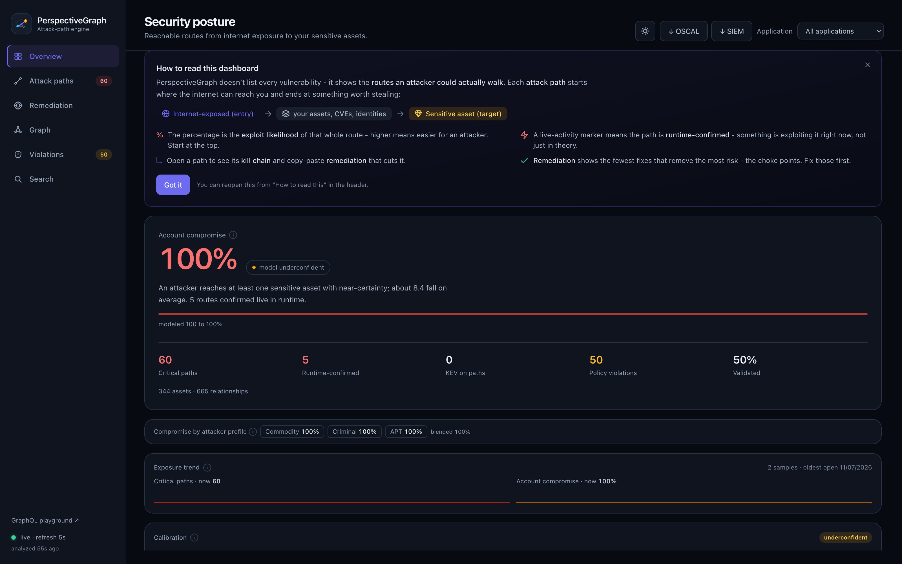
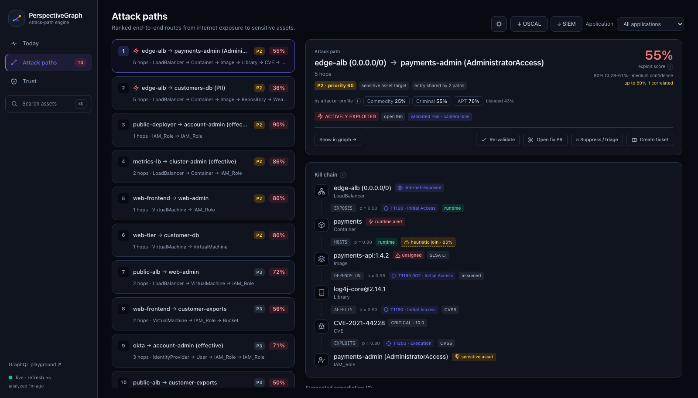
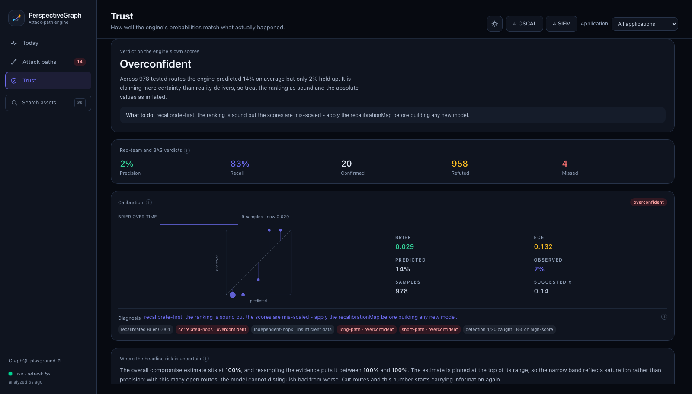

#  PerspectiveGraph

[](https://github.com/luiacuaniello/perspectivegraph/actions/workflows/ci.yml)
[](https://github.com/luiacuaniello/perspectivegraph/releases)
[](backend/go.mod)
[](LICENSE)

> **Catch the attack path in the pull request that opens it - then ship the fix as a PR.**

On every pull request, PerspectiveGraph (open source, Apache 2.0) answers one question against a
graph of your *real* environment - built from the scanners you already run (Trivy, Semgrep, Cloud
Custodian, Falco):

> *Does this change open a path from the internet, through excessive privilege, to something valuable?*

When it does, the **PR check goes red** - a required status you can block the merge on - and you get
the **fix as its own one-click pull request**. The reachable attack path is caught and closed in code
review, where it's cheapest, not months later in production. This is **shift-left attack-path
analysis**: not a scanner bolted onto CI, not a runtime CNAPP you log into after the fact - the
reachability question, answered *in the developer's workflow*.

That gate is powered by a full attack-path correlation engine, so the same graph also gives you the
rest: a queryable dashboard of your **~5 critical attack paths** (not 10,000 flat findings), triage,
runtime confirmation, an AI summary, and always-current architecture maps. **But the wedge is the
pull request.**




## See it in 90 seconds

```bash
make demo
```

Builds the stack, feeds it sample Trivy / Semgrep / Custodian / Falco / Kubernetes /
IAM / SSO output, waits for the analyzer, and prints the top attack path with its
generated fix. Dashboard on **http://localhost:3000**. Needs Docker, `jq` and `curl`;
first run takes a couple of minutes to build the images. Tear down with `make down`.

The dashboard opens on the decision, not the inventory: what is being exploited right
now, the fewest changes that remove the most risk, and how much the numbers can be
trusted.

| | |
|---|---|
|  |  |
| Every hop, its probability, where that probability came from, and the ATT&CK technique. | Whether the engine's own scores have matched reality. |

## Why?

Modern security teams don't suffer from a lack of tools - they suffer from **noise, fragmentation,
and missing context**.

| Role | Pain today | What PerspectiveGraph gives them |
| --- | --- | --- |
| **Developer** | CI/CD blocked by thousands of irrelevant CVEs | A PR check that goes red *only* when the change opens a real internet→sensitive-asset path - plus the fix as a one-click PR |
| **Security** | Triage on flat lists of 10,000 findings | A ranked list of ~5 critical **attack paths**, queryable like a database |
| **Architect** | No live view of how IaC becomes attack surface | Auto-generated, always-current architecture & data-flow maps + drift detection |


## Let an agent query it

A language model is weak at exactly what this engine is good at: it cannot enumerate
fourteen thousand edges reliably, it does not run Dijkstra, and asked for "the attack
paths in my account" it will produce plausible routes that do not exist. So the engine
speaks [MCP](https://modelcontextprotocol.io) - an agent calls it and reasons over
answers it could not have invented.

```bash
make mcp    # or: perspectivegraph mcp --api http://localhost:8080
```

```json
{"mcpServers": {"perspectivegraph": {
  "command": "perspectivegraph",
  "args": ["mcp", "--api", "http://localhost:8080"]}}}
```

Eight tools: `get_posture`, `list_attack_paths`, `explain_attack_path`,
`routes_to_target`, `list_fixes`, **`simulate_fix`**, `search_assets`,
`get_score_trust`. The one worth the integration is `simulate_fix` - it re-runs the
whole simulation with the given edges cut and reports what actually changes, settling
"would this help" with a deterministic counterfactual instead of an argument.

The surface is **read-only**: nothing suppresses a path, opens a PR or records a
verdict, because an agent that can silently accept a risk is a liability rather than a
feature. And the tool descriptions tell the model the scores are expert estimates and
to call `get_score_trust` before quoting one as a probability.

## Project status & maturity

PerspectiveGraph is **pre-1.0** and built in the open. Read this before you rely on it:

- **Engine: feature-complete.** The correlation engine, agentless connectors, triage,
  SSO, the PR merge-gate, the AI assistant, and the scale work are all implemented and
  covered by tests. The public API contract (GraphQL, ingest events, config, CLI) is
  documented and the GraphQL schema is frozen + drift-guarded - see the
  [API stability policy](docs/API-STABILITY.md).
- **Connector: validated against a real AWS account; scores: not yet field-calibrated.**
  The live connector, its read-only grant (`SecurityAudit` covers every call), cross-account
  `AssumeRole`, and the network↔identity join (`instance --ASSUMES--> role`) are **verified
  against a real account** - that last edge was in fact a gap only real-account testing
  exposed (the fixtures already contained edges AWS makes you derive). What is **not** yet
  done is calibrating the path *scores* against real exploited outcomes: the self-calibration
  flywheel has run end-to-end only on deliberately-vulnerable synthetic targets (a log4shell
  app, a `kind` RBAC scenario). Treat the scores as **directionally honest, not
  production-calibrated**. The `make validate-aws`, `make validate-harness-aws`, and
  `make validate-harness*` harnesses are the path to closing that on your own environment.
  For an offline, CI-gated check that the engine actually finds the *right* paths, `make
  bench-cloudgoat` grades it against a battery of [CloudGoat-shaped ground-truth
  scenarios](backend/testdata/cloudgoat/README.md) (precision/recall) - including the
  reachability-precision case (an open SG on a private-subnet box must **not** form a path)
  and the credential-origin case (a leaked-key privesc is invisible until `SEED_IAM_USERS`
  is on). It runs under `make test`, so a regression that loses or invents a path fails the build.
- **Deployment: demo-grade defaults.** The bundled `docker compose` / Helm setup is
  hardened for a demo (distroless, non-root, read-only rootfs, digest-pinned 0-CVE images,
  opt-in TLS). A production rollout still needs your own hardening: an external managed
  PostgreSQL+AGE, secrets in a manager (not env vars), TLS on by default, backups, and HA
  for the leader-gated scheduler. See the [operations & hardening runbook](docs/OPERATIONS.md),
  [`SECURITY.md`](SECURITY.md), and the [threat model](docs/THREAT-MODEL.md).
- **Scope.** It answers the reachable attack-path question in the developer workflow. It is
  not a scanner, a CNAPP, or a compliance product, and it does not replace them.

- **How it is written.** Developed by a human working with Claude (Anthropic): the design
  decisions and what ships are the maintainer's, a large share of the implementation and its
  tests came out of that collaboration. Said plainly for the same reason the engine reports its
  own calibration - a claim you can check beats one you have to accept. Check it:
  `make test`, `make bench-cloudgoat`, `govulncheck ./...`, `gosec ./...`. See
  [CONTRIBUTING](CONTRIBUTING.md).

Issues and PRs are welcome. Nothing here is claimed beyond what the tests and the listed
validation cover.


## Documentation

The [manual](docs/MANUAL.md) is the full reference: the scoring model, every
integration, deployment, hardening and the runbook for pointing it at your own
environment.

- [Manual](docs/MANUAL.md) - architecture, scoring, quick start, deploy, operate
- [Threat model](docs/THREAT-MODEL.md) · [Operations](docs/OPERATIONS.md) · [API stability](docs/API-STABILITY.md) · [Scale](docs/SCALE.md)
- [Attack-path benchmark](backend/testdata/cloudgoat/README.md) - the CI-gated precision/recall battery

Verify the claims rather than taking them: `make test`, `make bench-cloudgoat`
(precision/recall against known-vulnerable scenarios), `govulncheck ./...`.

## License

[Apache License 2.0](./LICENSE).
