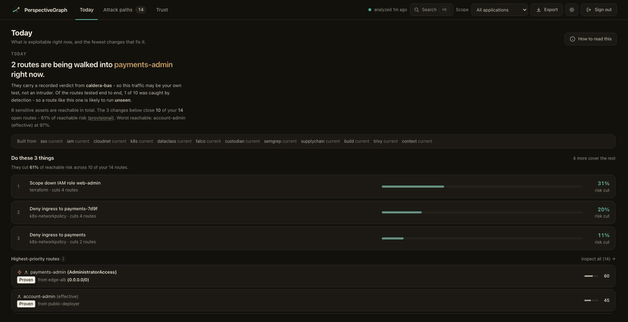
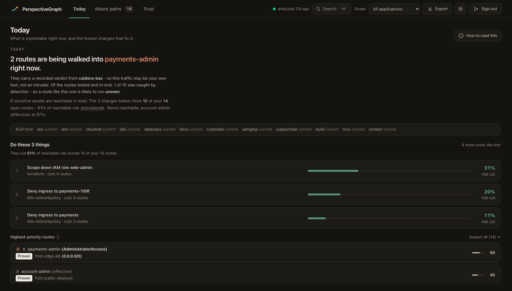
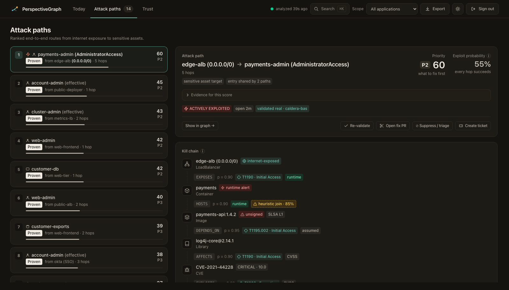
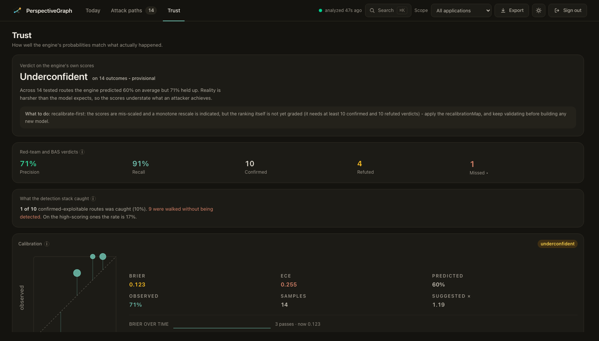

#  PerspectiveGraph

[](https://github.com/luiacuaniello/perspectivegraph/actions/workflows/ci.yml)
[](https://github.com/luiacuaniello/perspectivegraph/releases)
[](backend/go.mod)
[](LICENSE)
[](https://www.bestpractices.dev/projects/13828)

> **Catch the attack path in the pull request that opens it - then ship the fix as a PR.**

On every pull request, PerspectiveGraph (open source, Apache 2.0) answers one question against a
graph of your *real* environment - built from the scanners you already run (Trivy, Semgrep, Cloud
Custodian, Falco):

> *Does this change open a path from the internet, through excessive privilege, to something valuable?*

When it does, the **PR check goes red** - a required status you can block the merge on - and you get
the **fix as its own one-click pull request**. The reachable attack path is caught and closed in code
review, where it's cheapest, not months later in production. This is **shift-left attack-path
analysis**: not a scanner bolted onto CI, not a runtime CNAPP you log into after the fact - the
reachability question, answered *in the developer's workflow*.

That gate is powered by a full attack-path correlation engine, so the same graph also gives you the
rest: a queryable dashboard of your **~5 critical attack paths** (not 10,000 flat findings), triage,
runtime confirmation, an AI summary, and always-current architecture maps. **But the wedge is the
pull request.**




*Twenty seconds of `make demo`: what is exploitable now → the ranked routes → one route's
kill chain and the fix it generates → whether the scores can be trusted. Sample scanner
output and seeded verdicts, not a real environment.*

> ### What this has not done yet
>
> The engine reports probabilities, credible intervals and its own calibration - Brier
> score, ECE, a reliability diagram. **None of that has been calibrated against field
> data.** Nobody has yet run it over a real estate, tested the paths it surfaced, and fed
> the verdicts back. The machinery for that closed loop is built and tested; the loop has
> not been closed with real outcomes.
>
> So read a score as *"what this model believes, and how sure it says it is"*, not as a
> measured frequency. A path at 0.7 has not been shown to be exploited seven times in ten
> - it has been shown to be what the model concludes from the evidence it was given, and
> the interval beside it says how thin that evidence is.
>
> That is a statement about maturity, not about intent: the calibration harness exists
> precisely so that number can be earned rather than asserted, and the
> [CloudGoat benchmark](backend/testdata/cloudgoat/README.md) grades the path-finding itself on public,
> reproducible scenarios today. If you run this on a real environment and record what you
> find, [that is the contribution that matters most](CONTRIBUTING.md).

## Check your own account in 30 seconds

No deployment, no Docker, nothing ingested. One static binary asks **AWS's own policy
evaluator** which of your roles can reach administrator - applying the service control
policies, permission boundaries and condition keys that a policy reader on its own does
not see:

```bash
# macOS (Apple silicon); swap darwin_arm64 for linux_amd64, linux_arm64 or darwin_amd64
curl -sSL https://github.com/luiacuaniello/perspectivegraph/releases/latest/download/perspectivegraph_darwin_arm64.tar.gz | tar xz
./perspectivegraph redteam -roles -region eu-west-1
```

It is **read-only and free**: every check is one `iam:SimulatePrincipalPolicy` call, a
dry run that evaluates policy without performing anything, so it creates nothing and
costs nothing. It needs `iam:SimulatePrincipalPolicy` and `iam:ListRoles` - both inside
`SecurityAudit`. Binaries for linux/macOS (amd64, arm64) and Windows are on the
[releases page](https://github.com/luiacuaniello/perspectivegraph/releases/latest),
signed with cosign and carrying SLSA build provenance. The signature covers `SHA256SUMS`,
so one check covers every archive:

```bash
cosign verify-blob --bundle SHA256SUMS.bundle \
  --certificate-identity-regexp 'https://github.com/luiacuaniello/perspectivegraph/.*' \
  --certificate-oidc-issuer https://token.actions.githubusercontent.com \
  SHA256SUMS && sha256sum -c SHA256SUMS --ignore-missing
```

Add `-compare` and it also runs the engine over the same account and **exits non-zero
where the two disagree** - each disagreement is a false positive or a miss, in the
engine or in your assumptions. That check is how the permission-boundary bug described
in the [manual](docs/MANUAL.md) was found, and how it stays closed.

That command is also stage 0 of a fuller trial: [how to evaluate this](docs/EVALUATION.md)
walks from here to a verdict in stages that each end in an answer - and says what the
trial will *not* tell you before you spend a fortnight finding out.

## See the whole engine in 90 seconds

```bash
make demo
```

Pulls the **published, cosign-signed images**, feeds them sample Trivy / Semgrep /
Custodian / Falco / Kubernetes / IAM / SSO output, waits for the analyzer, and prints the
top attack path with its generated fix. Dashboard on **http://localhost:3000**. Needs
Docker, `jq` and `curl` - no Go or Node toolchain, and nothing is compiled: measured at
**23 seconds** from an empty image cache. Tear down with `make down`.

Building it yourself instead is `make demo-build`, which is the same demo from your
working tree. The images the fast path runs are the release artefacts, so you can check
what you are about to run before you run it - the `cosign verify` command is at the top of
[`docker-compose.demo.yml`](docker-compose.demo.yml).

Prefer not to build? The release images are published to GHCR (`latest` also tracks the
newest release; the pinned tag is the one to use if you care about reproducibility):

```bash
docker pull ghcr.io/luiacuaniello/perspectivegraph:v1.12.1 # x-release-please-version
docker pull ghcr.io/luiacuaniello/perspectivegraph-dashboard:v1.12.1 # x-release-please-version
```

On Kubernetes, the Helm chart is published the same way - no clone needed, and a version
you can pin and verify:

```bash
helm install perspectivegraph oci://ghcr.io/luiacuaniello/charts/perspectivegraph \
  --version 1.12.1 # x-release-please-version
```

They are signed with cosign keyless and carry an SPDX SBOM plus a SLSA build
provenance attestation - verify before you run, rather than taking the supply chain
on trust:

```bash
cosign verify \
  --certificate-identity-regexp 'https://github.com/luiacuaniello/perspectivegraph/.*' \
  --certificate-oidc-issuer https://token.actions.githubusercontent.com \
  ghcr.io/luiacuaniello/perspectivegraph:v1.12.1 # x-release-please-version
```

The dashboard opens on the decision, not the inventory: what is being exploited right
now, the fewest changes that remove the most risk, and how much the numbers can be
trusted.



Routes are ranked by a composite triage priority - what the route reaches, whether
runtime confirmed it, how exposed the entry is - not by raw exploit score, so a
lower-scoring route can and does outrank a higher-scoring one.

| | |
|---|---|
|  |  |
| Every hop, its probability, where that probability came from, and the ATT&CK technique. | Whether the engine's own scores held up against recorded outcomes. |

*Every screenshot on this page is `make demo`: sample scanner output and **seeded**
verdicts, not a real environment. That is why the calibration panel returns a verdict of
"underconfident" - across 14 seeded outcomes the engine predicted 60% where 71% held up.
Those outcomes were generated to exercise the instrument, not to flatter it. On a fresh
install the same page reads **"insufficient data"** and withholds a verdict until real
outcomes exist, because a risk score you cannot check is worth less than an honest blank.*

## Why?

Modern security teams don't suffer from a lack of tools - they suffer from **noise, fragmentation,
and missing context**.

| Role | Pain today | What PerspectiveGraph gives them |
| --- | --- | --- |
| **Developer** | CI/CD blocked by thousands of irrelevant CVEs | A PR check that goes red *only* when the change opens a real internet→sensitive-asset path - plus the fix as a one-click PR |
| **Security** | Triage on flat lists of 10,000 findings | A ranked list of ~5 critical **attack paths**, queryable like a database |
| **Architect** | No live view of how IaC becomes attack surface | Auto-generated, always-current architecture & data-flow maps + drift detection |


## Block the pull request that opens the path

**No deployment required.** The runner reads your estate read-only, ingests this pull
request's scan, and answers in-process with the same engine:

```yaml
- uses: luiacuaniello/perspectivegraph@v1
  with:
    mode: local
    aws-region: eu-west-1     # read-only; give the job an OIDC role with SecurityAudit
    report: trivy.json
```

An estate is not optional, and that is the point: without one there are no attack paths,
only a flat list of findings - the thing this replaces. If you collect your estate on its
own schedule, pass `estate: estate.json` (what `perspectivegraph awscollect -json` writes)
instead of `aws-region`.

Already running the engine? Point at it and it keeps the graph across pull requests, plus
triage, history and the dashboard:

```yaml
- uses: luiacuaniello/perspectivegraph@v1
  with:
    api: https://perspectivegraph.internal
    ingest: https://perspectivegraph.internal:8081
    report: trivy.json
    hmac-secret: ${{ secrets.PG_INGEST_HMAC }}
```

Both modes run the same normalizer, the same pathfinder and the same triage priority, and
return the same verdict - a test asserts they agree path-for-path on identical input.

The check goes red when *this commit* puts a sensitive asset within reach. Not when it
adds a critical CVE - a critical on a host nothing routes to does not fail the build, and
a medium on a container that now reaches the production database does. That is a
different question from the one your other scanners answer, and answering it needs a live
estate, which is why the action talks to a running engine instead of scanning the runner.

**It has three outcomes, and the third is the point.** Every two-state gate ever written
gives a pipeline whose scanner output never arrived the same green tick as one that is
genuinely clean. Here that is `unknown`, and it fails the build by default:

| Verdict | Exit | Meaning |
| --- | --- | --- |
| `clean` | 0 | The engine analysed this commit and found no path through it |
| `blocked` | 1 | Critical attack paths run through it - the check names them |
| `unknown` | 2 | **Nobody analysed it.** The scan, the ingest or the SHA is wrong |

Set `allow-unknown: true` while you roll the gate out. Leaving it on afterwards turns a
broken ingest back into a green check, which is the one thing this gate is for.

The same thing without GitHub Actions - the action is a thin wrapper over one command:

```bash
perspectivegraph gate -local -aws-region eu-west-1 \
  -report trivy.json -slug owner/name -sha "$COMMIT_SHA"
```

> **Two things to settle before wiring it up.**
>
> **Fork pull requests.** The gate needs secrets, and GitHub gives a fork's `pull_request`
> run none - so a fork PR cannot be analysed and fails closed as `unknown`. Do **not**
> reach for `pull_request_target` to work around it: that event runs with your secrets
> against the contributor's code, and in local mode your secrets are cloud credentials.
> Run the gate on `push` to your own branches instead, and let fork PRs go without it.
>
> **Public repositories.** When it blocks, the check prints the route - real asset names,
> the CVE linking them, the sensitive asset at the end - into the job log and summary,
> which on a public repository are public. Use `soft-fail` and post the detail somewhere
> private, or keep the gate on a private repository.

Full input reference in [`action.yml`](action.yml); the underlying query is `prVerdict`
in the [API schema](docs/api/schema.graphql).


## Let an agent query it

A language model is weak at exactly what this engine is good at: it cannot enumerate
fourteen thousand edges reliably, it does not run Dijkstra, and asked for "the attack
paths in my account" it will produce plausible routes that do not exist. So the engine
speaks [MCP](https://modelcontextprotocol.io) - an agent calls it and reasons over
answers it could not have invented.

```bash
make mcp    # or: perspectivegraph mcp --api http://localhost:8080
```

```json
{"mcpServers": {"perspectivegraph": {
  "command": "perspectivegraph",
  "args": ["mcp", "--api", "http://localhost:8080"]}}}
```

Eight tools: `get_posture`, `list_attack_paths`, `explain_attack_path`,
`routes_to_target`, `list_fixes`, **`simulate_fix`**, `search_assets`,
`get_score_trust`. The one worth the integration is `simulate_fix` - it re-runs the
whole simulation with the given edges cut and reports what actually changes, settling
"would this help" with a deterministic counterfactual instead of an argument.

The surface is **read-only**: nothing suppresses a path, opens a PR or records a
verdict, because an agent that can silently accept a risk is a liability rather than a
feature. Every tool declares that on the wire (`readOnlyHint`), so a host can decide what
to run unattended without taking this paragraph's word for it - and a test fails if a
tool is ever added without that decision. The descriptions also tell the model the scores
are expert estimates, and to call `get_score_trust` before quoting one as a probability.

## Project status & maturity

**The short version, if you read nothing else.** The engine and its public API are
complete, documented and tested. The AWS connector is verified against a real account.
The path *scores* are **not** calibrated against real exploited outcomes yet - read them
as a ranking, not as probabilities. So: use it to find and cut routes, and don't put its
risk percentage in front of a board. What is and isn't claimed is spelled out in
[positioning](docs/POSITIONING.md). It collects **no telemetry**: out of the box it opens
no outbound connection at all - GitHub, the AI assistant and the KEV/EPSS feeds each stay
dark until you set a key or flag (`THREATINTEL` is `off` by default).

**The benchmark, as of v1.12.1.** <!-- x-release-please-version --> `make bench-cloudgoat`
runs four CloudGoat-shaped scenarios in CI and grades the engine on each:

| Scenario | Expects | Result |
|---|---|---|
| `ec2_ssrf` | a path | found it, invented none |
| `iam_privesc_by_attachment` | a path (leaked-credential origin) | found it, invented none |
| `ec2_private_subnet_no_path` | **no** path (open SG, private subnet) | produced none |
| `iam_privesc_denied_by_guardrail` | **no** path (explicit Deny wins) | produced none |

Precision and recall are 1.00 on all four. Read that for what it is: four scenarios, two
of them negative controls - a regression gate against known shapes, not a measurement of
field accuracy on your estate.

The long version follows. PerspectiveGraph is **1.x and in active development**, built in
the open. The GraphQL schema is frozen and drift-guarded and the CLI/config surface is
documented, so a breaking change goes through a major version rather than arriving in a
patch - see the [API stability policy](docs/API-STABILITY.md). What's next is in the
[roadmap](ROADMAP.md); read this before you rely on it:

- **Engine: feature-complete.** The correlation engine, agentless connectors, triage,
  SSO, the PR merge-gate, the AI assistant, and the scale work are all implemented and
  covered by tests. The public API contract (GraphQL, ingest events, config, CLI) is
  documented and the GraphQL schema is frozen + drift-guarded - see the
  [API stability policy](docs/API-STABILITY.md).
- **Connector: validated against a real AWS account; scores: not yet field-calibrated.**
  The live connector, its read-only grant (`SecurityAudit` covers every call), cross-account
  `AssumeRole`, and the network↔identity join (`instance --ASSUMES--> role`) are **verified
  against a real account** - that last edge was in fact a gap only real-account testing
  exposed (the fixtures already contained edges AWS makes you derive). The
  reachability-precision claim is verified there too: `make reachability-lab-aws` stands up
  two instances behind **the same wide-open security group**, one in a subnet routed to an
  internet gateway and one in a subnet with no default route, and the engine marks only the
  first as exposed - suppressing the second with the reason, on real AWS rather than
  fixtures. What is **not** yet
  done is calibrating the path *scores* against real exploited outcomes: the self-calibration
  flywheel has run end-to-end only on deliberately-vulnerable synthetic targets (a log4shell
  app, a `kind` RBAC scenario). Treat the scores as **directionally honest, not
  production-calibrated**. One half of that gap is now closed against real AWS for free:
  `make redteam-aws` grades the engine's privilege-escalation claims with AWS's own policy
  evaluator - a read-only dry run that creates nothing and applies the SCPs and condition keys
  the engine's policy reader skips. That grading has already paid for itself: `make
  boundary-lab-aws` stands up two roles with an identical privesc policy that differ only in a
  permissions boundary, and it caught the engine calling both escalating where AWS allowed one
  and denied the other. **That false positive is now fixed** - the connector carries the
  boundary through and the evaluator intersects it - and the lab is the regression test,
  running the engine and AWS side by side on a real account and failing if they disagree.
  It deliberately does **not** rescale the path scores, and
  [the manual explains why it cannot](docs/MANUAL.md#closing-the-loop-calibration-against-observed-outcomes):
  those verdicts are one-sided, and a censored sample is not a measurement. The `make validate-aws`, `make validate-harness-aws`, and
  `make validate-harness*` harnesses are the path to closing that on your own environment.
  For an offline, CI-gated check that the engine actually finds the *right* paths, `make
  bench-cloudgoat` grades it against a battery of [CloudGoat-shaped ground-truth
  scenarios](backend/testdata/cloudgoat/README.md) (precision/recall) - including the
  reachability-precision case (an open SG on a private-subnet box must **not** form a path)
  and the credential-origin case (a leaked-key privesc is invisible until `SEED_IAM_USERS`
  is on). It runs under `make test`, so a regression that loses or invents a path fails the build.
- **Deployment: demo-grade defaults, with a production switch.** The **backend** is
  hardened wherever it runs (distroless, non-root, read-only rootfs, all capabilities
  dropped, digest-pinned 0-CVE images, opt-in TLS). Under `docker compose` the bundled
  dependencies - the dashboard's nginx, NATS, the demo Postgres - run as their images
  ship, because the demo has to stay one command. Under **Helm every workload, init
  containers included, satisfies the `restricted` Pod Security Standard**, asserted in CI
  on both value sets, so a namespace that enforces it admits the chart unmodified. The
  demo defaults are otherwise deliberately open. Set **`PG_ENV=production`** and the backend **refuses to start** unless both the
  API and ingest are authenticated - the permissive default cannot be reached by forgetting
  to configure it. A production rollout still needs your own hardening beyond that: an
  external PostgreSQL+AGE - **managed only on Azure, self-managed on AWS and GCP, because
  neither offers the AGE extension** ([the matrix](docs/OPERATIONS.md#3-the-database-postgresql--apache-age)) -
  secrets in a manager (not env vars), TLS on by default,
  backups, and HA for the leader-gated scheduler. **If you terminate at a reverse proxy or
  ingress, set `TRUSTED_PROXY_CIDRS`** to it: per-IP controls (rate limit, brute-force
  lockout, the address in the audit trail) otherwise key on the connecting peer - correct
  and unspoofable, but behind a proxy that is one key for everybody, so one attacker's
  failed logins lock out every user. `X-Forwarded-For` is believed only from the proxies
  named there, and only the hops they added. For people use OIDC, so revoking access is
  your IdP's job rather than a token rotation - see the
  [operations & hardening runbook](docs/OPERATIONS.md), [`SECURITY.md`](SECURITY.md), and the
  [threat model](docs/THREAT-MODEL.md).
- **Support: the newest release, and nothing behind it.** There are no backports and no LTS
  branch - at six minor releases in the eight days after 1.0, a maintenance branch would be
  a promise one maintainer breaks. What is promised instead is a clock on security fixes
  (Critical 7 days, High 30, from confirmation) and an upgrade specified rather than hoped
  for: semver over an enumerated stable surface, a drift-guarded schema, no migration step,
  and rollback by redeploying the previous digest. [SUPPORT.md](SUPPORT.md) is the policy,
  including how to run this where change control applies.
- **Scope.** It answers the reachable attack-path question in the developer workflow. It is
  not a scanner, a CNAPP, or a compliance product, and it does not replace them.

- **How it is written.** Developed by a human working with Claude (Anthropic): the design
  decisions and what ships are the maintainer's, a large share of the implementation and its
  tests came out of that collaboration. Said plainly for the same reason the engine reports its
  own calibration - a claim you can check beats one you have to accept. Check it:
  `make test`, `make bench-cloudgoat`, `govulncheck ./...`, `gosec ./...`. See
  [CONTRIBUTING](CONTRIBUTING.md).

Issues and PRs are welcome. Nothing here is claimed beyond what the tests and the listed
validation cover.


## Documentation

The [manual](docs/MANUAL.md) is the full reference: the scoring model, every
integration, deployment, hardening and the runbook for pointing it at your own
environment.

- [Evaluation](docs/EVALUATION.md) - trying it on your own estate, in stages that each end in an answer
- [Manual](docs/MANUAL.md) - architecture, scoring, quick start, deploy, operate
- [Positioning](docs/POSITIONING.md) - what is claimed, what is **not**, and how to check
- [Support](SUPPORT.md) - which versions get fixes, how fast, and how to run this under change control
- [Upgrading](docs/UPGRADING.md) - the releases that need an action from you, and what it is
- [Roadmap](ROADMAP.md) - what's next, and what it deliberately isn't becoming
- [Threat model](docs/THREAT-MODEL.md) · [Operations](docs/OPERATIONS.md) · [API stability](docs/API-STABILITY.md) · [Scale](docs/SCALE.md)
- [Governance](GOVERNANCE.md) · [Maintainers](MAINTAINERS.md) · [Adopters](ADOPTERS.md) - who decides, who maintains, who runs it
- [Attack-path benchmark](backend/testdata/cloudgoat/README.md) - the CI-gated precision/recall battery

Verify the claims rather than taking them: `make test`, `make bench-cloudgoat`
(precision/recall against known-vulnerable scenarios), `govulncheck ./...`.

## License

[Apache License 2.0](./LICENSE).
