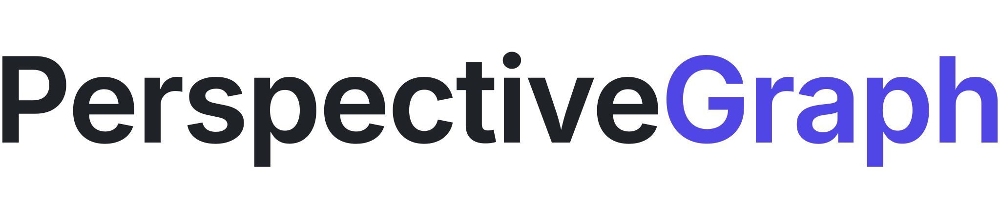

<h1 align="center">
  
  <picture>
    <source media="(prefers-color-scheme: dark)" srcset="docs/wordmark-dark.svg">
    
  </picture>
</h1>

<p align="center"><strong>Your scanners find issues. This finds the way in.</strong></p>

<p align="center">
  <a href="https://github.com/luiacuaniello/perspectivegraph/actions/workflows/ci.yml"></a>
  <a href="https://github.com/luiacuaniello/perspectivegraph/releases"></a>
  <a href="LICENSE"></a>
  <a href="https://demo.a3thinker.it"></a>
</p>

PerspectiveGraph joins what you already run - Trivy, Semgrep, Cloud Custodian, Falco, plus your
AWS and Kubernetes state - into one graph of your *real* environment, and asks a single question
of it: **can someone get from the internet, through privilege that is too broad, to something
worth stealing?**

On a pull request it asks that question **before the merge**: the check goes red only when *this
change* opens a route, and the fix comes back as its own pull request. Open source (Apache 2.0),
runs on your infrastructure, collects no telemetry.


*Twelve seconds of `make demo`: what is exploitable now → the ranked routes → one route's kill
chain and the fix it generates → whether the scores can be trusted. Sample scanner output and
seeded verdicts, not a real environment.*

- **[See it running](https://demo.a3thinker.it)** - the same dashboard, published read-only. Nothing to install.
- **[Check your own AWS account](#check-your-own-account-in-30-seconds)** - one read-only command, no deployment.
- **[Put it on your pull requests](#block-the-pull-request-that-opens-the-path)** - ten lines of YAML.

A score here is what the model concludes from the evidence it was given, not a measured
frequency: **nothing has been calibrated against field data yet**, and the engine says so itself
rather than rounding up. [What is measured, and what is not](#project-status--maturity).

## Check your own account in 30 seconds

No deployment, no Docker, nothing ingested. One static binary asks **AWS's own policy
evaluator** which of your roles can reach administrator - applying the service control
policies, permission boundaries and condition keys that a policy reader on its own does not
see:

```bash
# macOS (Apple silicon); swap darwin_arm64 for linux_amd64, linux_arm64 or darwin_amd64
curl -sSL https://github.com/luiacuaniello/perspectivegraph/releases/latest/download/perspectivegraph_darwin_arm64.tar.gz | tar xz
./perspectivegraph redteam -roles -region eu-west-1
```

It is **read-only and free**: each check is one `iam:SimulatePrincipalPolicy` dry run, which
creates nothing and costs nothing, and the only permissions it needs are that and
`iam:ListRoles`, both inside `SecurityAudit`. Windows builds are on the
[releases page](https://github.com/luiacuaniello/perspectivegraph/releases/latest); every binary
is signed with cosign and carries SLSA provenance, and two commands
[verify both](SECURITY.md#our-own-supply-chain) before you run anything.

Add `-compare` and it also runs the engine over the same account, **exiting non-zero where the
two disagree**. That is how the engine's
[first real false positive](docs/MANUAL.md#the-engines-first-demonstrated-false-positive---found-then-closed)
was found, and how it stays fixed. If it disagrees on yours,
[report it](https://github.com/luiacuaniello/perspectivegraph/issues/new?template=engine-vs-aws.yml): no report is more useful. From here, [how to evaluate this](docs/EVALUATION.md) walks to a
verdict on your own estate in stages that each end in an answer.

## See the whole engine in 90 seconds

```bash
make demo
```

Pulls the **published, cosign-signed images**, feeds them sample Trivy / Semgrep / Custodian /
Falco / Kubernetes / IAM / SSO output, and prints the top attack path with its generated fix.
Dashboard on **http://localhost:3000**, `make down` to tear it down. It needs Docker, `jq` and
`curl`, compiles nothing, and takes about 23 seconds from an empty image cache; `make demo-build`
is the same demo built from your working tree.

On Kubernetes, the chart is an
[official package on Artifact Hub](https://artifacthub.io/packages/helm/perspectivegraph/perspectivegraph):

```bash
helm install perspectivegraph oci://ghcr.io/luiacuaniello/charts/perspectivegraph \
  --version 1.20.0 # x-release-please-version
```

The chart and the three images it runs (`ghcr.io/luiacuaniello/perspectivegraph`, `-dashboard`
and `-postgres`) are signed with cosign keyless and carry an SPDX SBOM and SLSA provenance:
[verify them](SECURITY.md#our-own-supply-chain) rather than taking the supply chain on trust.

The dashboard opens on the decision, not the inventory: what is being exploited now, the fewest
changes that remove the most risk, and how far the numbers can be trusted. Routes are ranked by
triage priority - what the route reaches, whether runtime confirmed it, how exposed the entry
is - so a lower-scoring route can outrank a higher-scoring one.


| | |
|---|---|
|  |  |
| Every hop, its probability, where that probability came from, and the ATT&CK technique. | Whether the engine's own scores held up against recorded outcomes. |

*The screenshots are `make demo` with **seeded** verdicts, which is why the calibration panel
gives one ("underconfident": across 14 outcomes generated to exercise it, the engine predicted 60%
where 71% held up). A fresh install and the [public demo](https://demo.a3thinker.it) report
**insufficient data** instead, until real outcomes exist. The public demo runs on one free VM, so
treat it as best-effort.*

## Why?

A scanner reports that a container carries a critical CVE. It cannot report that the container
sits behind an internet-facing load balancer, runs with a role that reads the production
database, and is therefore the one finding out of ten thousand worth fixing this week. That
needs the other tools' output in the same graph, which is what this builds. A developer gets a
check that goes red only when their change opens a real route; a security team gets a short
ranked list of attack paths instead of a flat list of findings.

## Block the pull request that opens the path

**No deployment required.** The runner reads your estate read-only, ingests this pull request's
scan, and answers in-process with the same engine:

```yaml
- uses: luiacuaniello/perspectivegraph@v1
  with:
    mode: local
    aws-region: eu-west-1     # read-only; give the job an OIDC role with SecurityAudit
    report: trivy.json
```

The check goes red when *this commit* puts a sensitive asset within reach, not when it adds a
critical CVE: a critical on a host nothing routes to does not fail the build, and a medium on a
container that now reaches the production database does. It also has a third outcome, because a
pipeline whose scan never arrived must not get the same green tick as one that is clean:

| Verdict | Exit | Meaning |
| --- | --- | --- |
| `clean` | 0 | The engine analysed this commit and found no path through it |
| `blocked` | 1 | Critical attack paths run through it - the check names them |
| `unknown` | 2 | **Nobody analysed it.** The scan, the ingest or the SHA is wrong |

Outside GitHub Actions it is one command, and it installs as a Trivy plugin too:

```bash
perspectivegraph gate -local -aws-region eu-west-1 -report trivy.json -slug owner/name -sha "$COMMIT_SHA"

trivy plugin install github.com/luiacuaniello/perspectivegraph
trivy image -f json myapp:pr-42 | trivy perspectivegraph gate -local -aws-region eu-west-1 -report -
```

> [!WARNING]
> **Fork pull requests** get no secrets, so the gate fails closed as `unknown` on them. Do not
> work around it with `pull_request_target`: that runs your secrets - in local mode, cloud
> credentials - against the contributor's code.
>
> **On a public repository**, a blocked check prints the route (real asset names, the CVE, the
> sensitive asset) into a public job log. Use `soft-fail` and post the detail somewhere private.

The [manual](docs/MANUAL.md#the-merge-gate-github-action-cli-and-trivy-plugin) covers the rest:
pointing the action at a deployed engine, gating rendered manifests, a pre-collected estate,
rolling the gate out, and every input in [`action.yml`](action.yml).

## Let an agent query it

A language model cannot enumerate thousands of edges reliably or run Dijkstra, and asked for
"the attack paths in my account" it will invent plausible ones. So the engine speaks
[MCP](https://modelcontextprotocol.io): the agent asks, and reasons over answers it could not
have made up.

```bash
perspectivegraph mcp --api http://localhost:8080   # or https://demo.a3thinker.it, no credential needed
```

Eight tools, every one **read-only** and declared so on the wire. The one worth the integration
is `simulate_fix`: it re-runs the simulation with the given edges cut and reports what actually
changes. The server is in the official [MCP Registry](https://registry.modelcontextprotocol.io)
and on [Glama](https://glama.ai/mcp/servers/luiacuaniello/perspectivegraph); the tools and the
client configuration are in the [manual](docs/MANUAL.md#letting-an-agent-query-it-mcp).

[](https://glama.ai/mcp/servers/luiacuaniello/perspectivegraph)

## Project status & maturity

[](https://www.bestpractices.dev/projects/13828)
[](https://artifacthub.io/packages/helm/perspectivegraph/perspectivegraph)
[](backend/go.mod)

**The engine and its public API are complete, documented and tested. The scores are not yet
calibrated.** Nobody has run this over a real estate, tested the paths it surfaced and fed the
verdicts back: the machinery for that loop is built and tested, the loop is not closed. So read a
score as what the model believes and how sure it says it is, not as a measured frequency. Use it
to find and cut routes; don't put its percentage in front of a board.
[Positioning](docs/POSITIONING.md) spells out what is and isn't claimed.

**What is measured today, as of v1.20.0.** <!-- x-release-please-version -->
`make bench-cloudgoat` grades the engine in CI on four
[CloudGoat-shaped scenarios](backend/testdata/cloudgoat/README.md):

| Scenario | Expects | Result |
|---|---|---|
| `ec2_ssrf` | a path | found it, invented none |
| `iam_privesc_by_attachment` | a path (leaked-credential origin) | found it, invented none |
| `ec2_private_subnet_no_path` | **no** path (open SG, private subnet) | produced none |
| `iam_privesc_denied_by_guardrail` | **no** path (explicit Deny wins) | produced none |

Precision and recall are 1.00 on all four: four known shapes, two of them negative controls, so a
regression gate rather than a measure of accuracy on your estate. On real AWS,
`make reachability-lab-aws` checks exposure the same way for free, and `make redteam-aws` grades
the engine's escalation claims against AWS's own policy evaluator. That grading has already
caught one false positive, a permissions boundary the engine ignored; it is fixed, and
`make boundary-lab-aws` fails whenever the engine and AWS disagree.

- **Clouds.** AWS is live and verified against a real account, cross-account `AssumeRole`
  included. Azure is fixtures only, and there is no GCP connector.
- **Interface.** The GraphQL schema is frozen and drift-guarded, so a breaking change comes with
  a major version, never in a patch: [API stability](docs/API-STABILITY.md).
- **Deployment.** The backend is distroless and non-root on a read-only root filesystem, the
  images are pinned by digest, and under Helm every workload meets the `restricted` Pod Security
  Standard, asserted in CI. The compose defaults are open on purpose; `PG_ENV=production` refuses
  to start unless API and ingest are authenticated. A real rollout needs more (external
  PostgreSQL with AGE, TLS, backups, `TRUSTED_PROXY_CIDRS` behind a proxy): the
  [operations runbook](docs/OPERATIONS.md) lists it.
- **Support.** The newest release only, with a clock on security fixes (Critical 7 days, High
  30): [SUPPORT.md](SUPPORT.md).
- **Telemetry.** None. Out of the box it opens no outbound connection; GitHub, the AI assistant
  and the KEV/EPSS feeds each stay off until you configure them.
- **Scope.** The reachable attack-path question, in the developer workflow. It is not a scanner,
  a CNAPP or a compliance product, and replaces none of them.
- **How it is written.** By a human working with Claude (Anthropic): the design decisions and
  what ships are the maintainer's, and much of the implementation and its tests came out of that
  collaboration. Check it rather than trust it: `make test`, `make bench-cloudgoat`,
  `govulncheck ./...`, and [CONTRIBUTING](CONTRIBUTING.md).

## Documentation

- [Manual](docs/MANUAL.md) - architecture, scoring, every integration, deployment, and the runbook for your own environment
- [Evaluation](docs/EVALUATION.md) - trying it on your own estate, in stages that each end in an answer
- [Positioning](docs/POSITIONING.md) - what is claimed, what is **not**, and how to check
- [Operations](docs/OPERATIONS.md) · [Threat model](docs/THREAT-MODEL.md) · [Scale](docs/SCALE.md) · [API stability](docs/API-STABILITY.md)
- [Support](SUPPORT.md) · [Upgrading](docs/UPGRADING.md) · [Roadmap](ROADMAP.md) · [Security](SECURITY.md)
- [Contributing](CONTRIBUTING.md) · [Governance](GOVERNANCE.md) · [Maintainers](MAINTAINERS.md) · [Adopters](ADOPTERS.md)

## License

[Apache License 2.0](LICENSE).
